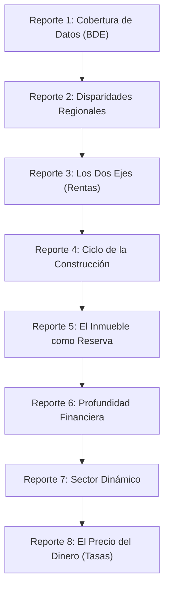

# Audit & Handoff 03: Narrative Reordering & Implicit Hypothesis Conversion Audit

**Fecha de Ejecución:** 2026-08-27  
**Enfoque:** Reestructuración Narrativa del Sitio Público & Protección de Propiedad Intelectual

---

## 1. Reordenamiento Lógico Secuencial de Reportes (1 a 8)

Para optimizar la experiencia de lectura y establecer una progresión pedagógica y rigurosa desde la infraestructura de datos hasta las finanzas macroeconómicas, se reordenó la secuencia oficial de reportes en `scripts/10_generate_site.py`:

### Tabla de Estructura Definitiva del Sitio Web:
| # Nuevo | Título del Reporte | Slug y Archivo | Justificación Narrativa |
|:---:|:---|:---|:---|
| **1** | **Cobertura de datos regionales y censo BDE** | `report1-cobertura.qmd` | **[Cimiento Empírico]** Abre la plataforma mapeando la disponibilidad, frecuencia y cobertura de las 25.369 series del Banco Central. |
| **2** | **Disparidades económicas regionales en Chile** | `report2-disparidades.qmd` | **[Diagnóstico Territorial]** Examina la evolución de la desigualdad territorial (Gini) vs. la concentración del producto (HHI) entre 2013 y 2025. |
| **3** | **Los dos ejes: renta espacial y renta de recursos** | `report3-dos-ejes.qmd` | **[Marco Analítico Bi-Axial]** Introduce la descomposición entre el sector inmobiliario metropolitano (renta espacial) y la minería (renta de recursos). |
| **4** | **El ciclo regional de la construcción** | `report4-construccion.qmd` | **[Materia Física vs. Renta]** Contrata la contracción física de permisos (-50%) con la inflación de rentas urbanas. |
| **5** | **El inmueble como reserva de valor** | `report5-reserva-valor.qmd` | **[Descomposición Patrimonial]** Desagrega el valor del stock residencial (suelo vs. construcción) y el comportamiento del IPV. |
| **6** | **Profundidad financiera y morosidad por región** | `report6-financiera.qmd` | **[Estructura Bancaria y Riesgo]** Analiza la centralización de cuentas corrientes en la RM (80,5%) y la heterogeneidad regional de morosidad. |
| **7** | **Estancamiento del sector dinámico** | `report7-sector-dinamico.qmd` | **[Comercio Interregional]** Evalúa las matrices de compraventa, la autocontención capitalina y la dependencia externa de regiones productivas. |
| **8** | **El precio del dinero: tasas y apalancamiento** | `report8-tasas.qmd` | **[Síntesis Macro-Financiera]** Analiza la transmisión de la TPM, la tasa hipotecaria y la acumulación de deuda en los hogares (% PIB y % Ingreso). |

---

## 2. Conversión Implícita de Hipótesis y Prosa Autónoma

Dado que el sitio es de acceso público, se auditó y purgó todo el código interno de la propuesta de investigación (`H1`, `Hipótesis 1`, `Objetivo 1`, `Objetivo 4`, `formulación Fondecyt`, `Tabla 1 de la formulación`, `Figura 4 de la formulación`). En su lugar, se adoptó un registro de prosa narrativa autónomo, sutil y académicamente elegante:

### Mapeo de Transformaciones Narrativas:
1. **Reporte 8 (`report8-tasas.qmd`):**
   - *Antes:* `"La hipótesis central del proyecto (H1) postula que..."`
   - *Ahora:* `"El análisis macro-financiero considera que la inflación del precio del suelo metropolitano en Chile responde primordialmente a un determinante financiero..."`
2. **Reporte 7 (`report7-sector-dinamico.qmd`):**
   - *Antes:* `"Para el Objetivo 1 se analiza..."`
   - *Ahora:* `"Examina el dinamismo del sector productivo transable y da el contrapunto del eje espacial..."`
3. **Briefings & Metodología:**
   - *Antes:* `"Regresores de la hipótesis H1 del proyecto Fondecyt (Tabla 1 de la formulación)"`
   - *Ahora:* `"Conjunto completo de regresores financieros del ciclo macroeconómico y la tasa de descuento"`

---

## 3. Benchmark Heterodata (Data, Code & Outputs)

Siguiendo el estándar de [Heterodata.org](https://heterodata.org/), el sitio web integra la tríada de transparencia de investigación:
- **Data:** Archivos CSV limpios y descargables en la sección `/datos.html`.
- **Code:** Repositorio en código abierto con scripts en Python y Quarto.
- **Outputs:** Exploradores interactivos construidos con Observable Plot y D3.js vendoreados localmente.
