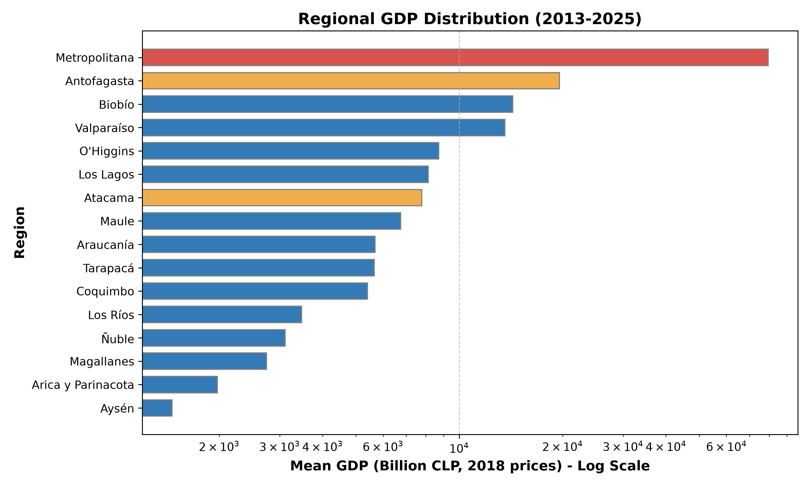
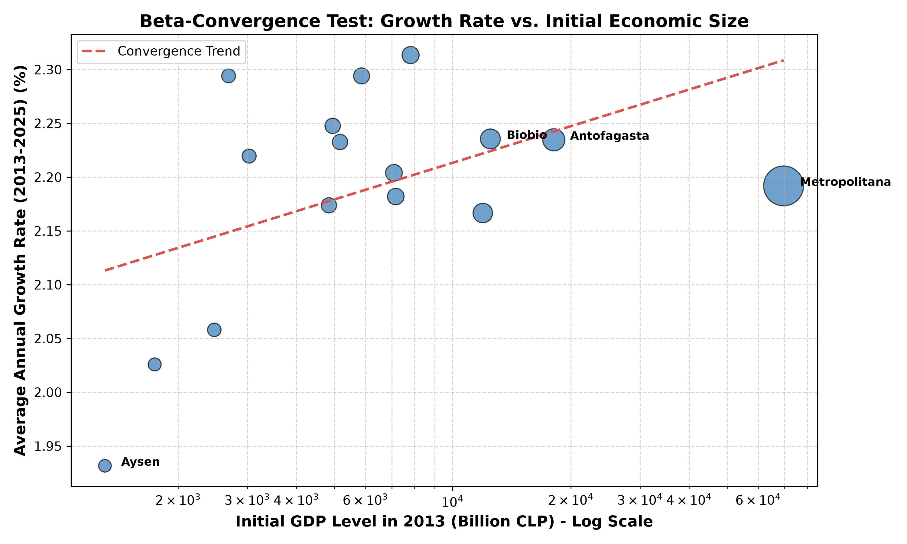
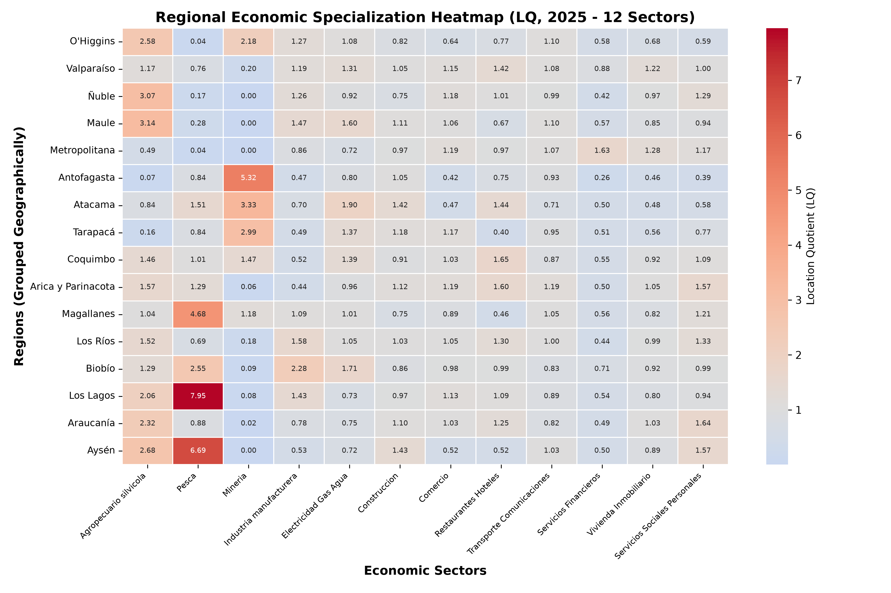
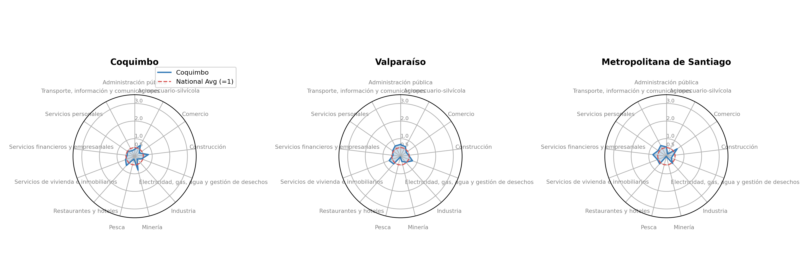
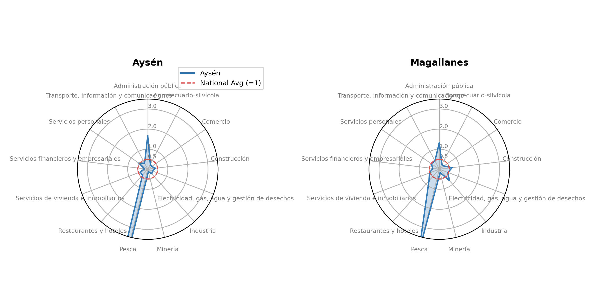
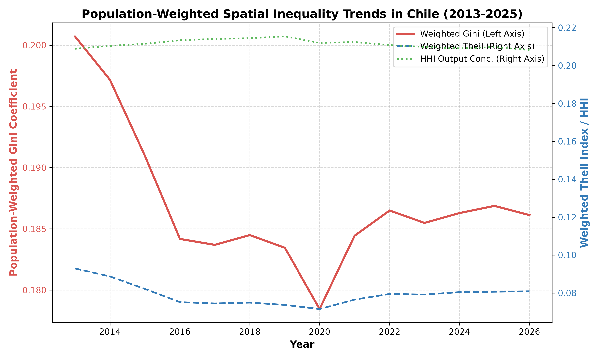
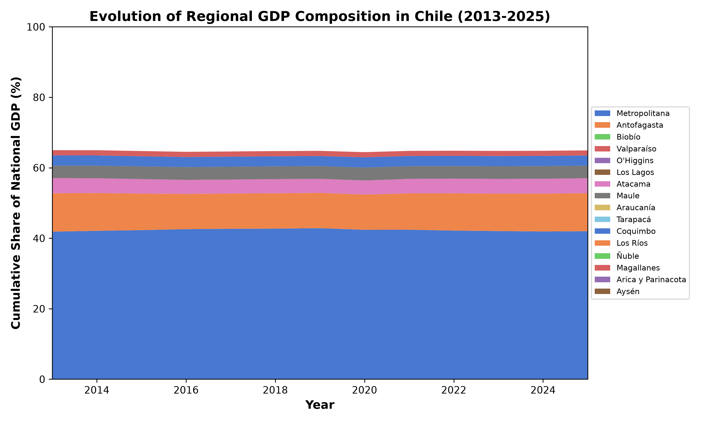

# **Report: Regional Economic Disparities in Chile - A Descriptive Analysis (2013-2025)**

## **1. Introduction**

Chile is historically characterized by high economic centralization and spatial inequality. This report presents a descriptive analysis of regional economic disparities in Chile over the 2013-2025 period, utilizing annual regional GDP figures from the Central Bank of Chile (BCCh) statistical database (measured in chained volume, reference base year 2018). The dataset covers all 16 administrative regions of Chile, tracking their economic output, growth dynamics, sectoral specialization patterns, and spatial inequality indices.

---

## **2. Section 1: Regional Economic Size and Growth Dynamics**

Table 1 summarizes the key parameters of economic output for the 16 Chilean regions. The dominance of the Metropolitana region is clear, accounting for over 43% of national GDP, followed by mining-heavy regions such as Antofagasta. 

### **Table 1: Summary Statistics of Regional Economic Output (2013-2025)**

| Region | Mean GDP (Billion CLP) | Share of National GDP (%) | Avg. Annual Growth Rate (%) | Output Volatility (Std. Dev.) |
| :--- | :---: | :---: | :---: | :---: |
| Metropolitana | 79,318.20 | 42.28% | 2.19% | 4.65 |
| Antofagasta | 19,572.79 | 10.41% | 2.23% | 5.75 |
| Biobío | 14,307.09 | 7.63% | 2.24% | 3.79 |
| Valparaíso | 13,577.52 | 7.24% | 2.17% | 3.77 |
| O'Higgins | 8,716.62 | 4.64% | 2.31% | 4.79 |
| Los Lagos | 8,128.96 | 4.33% | 2.20% | 3.79 |
| Atacama | 7,773.85 | 4.14% | 2.18% | 5.61 |
| Maule | 6,760.34 | 3.60% | 2.29% | 3.58 |
| Araucanía | 5,684.10 | 3.03% | 2.25% | 3.97 |
| Tarapacá | 5,659.85 | 3.01% | 2.23% | 5.07 |
| Coquimbo | 5,406.40 | 2.88% | 2.17% | 4.27 |
| Los Ríos | 3,474.68 | 1.85% | 2.22% | 3.81 |
| Ñuble | 3,114.24 | 1.66% | 2.29% | 3.88 |
| Magallanes | 2,744.74 | 1.46% | 2.06% | 4.72 |
| Arica y Parinacota | 1,977.14 | 1.05% | 2.03% | 4.27 |
| Aysén | 1,458.52 | 0.78% | 1.93% | 4.28 |

### **Corresponding Figures**

#### **Figure 1.1: Regional GDP Distribution - The Santiago Dominance**

*Figure 1.1 highlights the massive size discrepancy between the Metropolitana region (highlighted in red) and all other regions. Primary resource mining regions such as Antofagasta (orange) follow, but still operate at a fraction of the capital's output scale.*

#### **Figure 1.2: Growth vs. Size - Convergence Patterns**

*Figure 1.2 tests for $\beta$-convergence. Standard neoclassical growth theory suggests that poorer regions (with lower initial GDP in 2013) should grow faster than richer regions, producing a downward-sloping trendline. In Chile, this relationship is weakly negative but heavily disrupted by high-growth mining economies (like Antofagasta) and stagnant rural regions.*

---

## **3. Section 2: Regional Economic Specialization (12-Sector Decomposition)**

Location Quotients (LQ) reveal how specialized a region is in a particular sector relative to the national average. An LQ greater than 1.0 indicates that a sector's share in regional output is larger than its share in the national economy. This section leverages the official 12-sector regional GDP classification compiled by the Central Bank of Chile to extract the structural composition of the territories.

### **Methodological Formalization**

The Location Quotient ($LQ_{i,s}$) for region $i$ and sector $s$ is formalized as:
$$LQ_{i,s} = \frac{Y_{i,s} / Y_i}{Y_{\text{nat},s} / Y_{\text{nat}}}$$
where:
- $Y_{i,s}$ is the GDP of sector $s$ in region $i$,
- $Y_i = \sum_{s=1}^m Y_{i,s}$ is the total GDP of region $i$ across all $m$ sectors,
- $Y_{\text{nat},s} = \sum_{j=1}^n Y_{j,s}$ is the national GDP of sector $s$ across all $n$ regions,
- $Y_{\text{nat}} = \sum_{j=1}^n \sum_{k=1}^m Y_{j,k}$ is the total national GDP.

### **Table 2: Location Quotients (LQ) by Region and Sector (2025 - 12 Sectors)**

| Region | Agro | Fish | Mine | Manuf | EGA | Const | Trade | Hotels | Transp | Finan | RealEst | Social |
| :--- | :---: | :---: | :---: | :---: | :---: | :---: | :---: | :---: | :---: | :---: | :---: | :---: |
| **Arica y Parinacota** | 1.57 | 1.29 | 0.06 | 0.44 | 0.96 | 1.12 | 1.19 | 1.60 | 1.19 | 0.50 | 1.05 | 1.57 |
| **Tarapacá** | 0.16 | 0.84 | 2.99 | 0.49 | 1.37 | 1.18 | 1.17 | 0.40 | 0.95 | 0.51 | 0.56 | 0.77 |
| **Antofagasta** | 0.07 | 0.84 | 5.32 | 0.47 | 0.80 | 1.05 | 0.42 | 0.75 | 0.93 | 0.26 | 0.46 | 0.39 |
| **Atacama** | 0.84 | 1.51 | 3.33 | 0.70 | 1.90 | 1.42 | 0.47 | 1.44 | 0.71 | 0.50 | 0.48 | 0.58 |
| **Coquimbo** | 1.46 | 1.01 | 1.47 | 0.52 | 1.39 | 0.91 | 1.03 | 1.65 | 0.87 | 0.55 | 0.92 | 1.09 |
| **Valparaíso** | 1.17 | 0.76 | 0.20 | 1.19 | 1.31 | 1.05 | 1.15 | 1.42 | 1.08 | 0.88 | 1.22 | 1.00 |
| **Metropolitana** | 0.49 | 0.04 | 0.00 | 0.86 | 0.72 | 0.97 | 1.19 | 0.97 | 1.07 | 1.63 | 1.28 | 1.17 |
| **O'Higgins** | 2.58 | 0.04 | 2.18 | 1.27 | 1.08 | 0.82 | 0.64 | 0.77 | 1.10 | 0.58 | 0.68 | 0.59 |
| **Maule** | 3.14 | 0.28 | 0.00 | 1.47 | 1.60 | 1.11 | 1.06 | 0.67 | 1.10 | 0.57 | 0.85 | 0.94 |
| **Ñuble** | 3.07 | 0.17 | 0.00 | 1.26 | 0.92 | 0.75 | 1.18 | 1.01 | 0.99 | 0.42 | 0.97 | 1.29 |
| **Biobío** | 1.29 | 2.55 | 0.09 | 2.28 | 1.71 | 0.86 | 0.98 | 0.99 | 0.83 | 0.71 | 0.92 | 0.99 |
| **Araucanía** | 2.32 | 0.88 | 0.02 | 0.78 | 0.75 | 1.10 | 1.03 | 1.25 | 0.82 | 0.49 | 1.03 | 1.64 |
| **Los Ríos** | 1.52 | 0.69 | 0.18 | 1.58 | 1.05 | 1.03 | 1.05 | 1.30 | 1.00 | 0.44 | 0.99 | 1.33 |
| **Los Lagos** | 2.06 | 7.95 | 0.08 | 1.43 | 0.73 | 0.97 | 1.13 | 1.09 | 0.89 | 0.54 | 0.80 | 0.94 |
| **Aysén** | 2.68 | 6.69 | 0.00 | 0.53 | 0.72 | 1.43 | 0.52 | 0.52 | 1.03 | 0.50 | 0.89 | 1.57 |
| **Magallanes** | 1.04 | 4.68 | 1.18 | 1.09 | 1.01 | 0.75 | 0.89 | 0.46 | 1.05 | 0.56 | 0.82 | 1.21 |

### **Corresponding Figures**

#### **Figure 2.1: 12-Sector Specialization Heatmap**

*The heatmap immediately exposes Chile's geographical economic identities across all 12 economic sectors. It highlights the mining-dominant North, the services-oriented Center, and the agricultural-fishing South.*

#### **Figure 2.2: 12-Sector Regional Specialization Radar Charts by Macro-Zone**

We group the regional radar charts by geographic macro-zones to expose shared regional structures and territorial clusters:

##### **1. Macro-Zona Norte (Mining Core)**

*Figure 2.2a details the Norte macro-zone (*Arica y Parinacota, Tarapacá, Antofagasta, Atacama*). It is characterized by heavy specialization in Mining, with Antofagasta displaying a massive mining quotient ($LQ > 5.0$). Poorer northern regions like Arica exhibit a shift toward public administration and social services, while agricultural sectors are virtually non-existent due to desert terrain.*

##### **2. Macro-Zona Centro (Services & Port Hub)**

*Figure 2.2b outlines the Centro macro-zone (*Coquimbo, Valparaíso, Metropolitana*). Metropolitana exhibits high concentration in Services and Financial activities ($LQ > 1.5$), serving as the national business center. Valparaíso balances port-related transport and commerce with tourism (Services and Commerce). Coquimbo represents a transition zone, blending mining in the interior valleys with agriculture.*

##### **3. Macro-Zona Centro Sur (Agricultural-Industrial Heartland)**

*Figure 2.2c shows the Centro Sur macro-zone (*O\'Higgins, Maule, Ñuble, Biobío*). Biobío acts as the industrial heartland with a significant Manufacturing specialization ($LQ > 1.5$), while Maule and Ñuble exhibit heavy concentration in Agriculture and Agropecuario ($LQ > 2.5$). O\'Higgins presents a dual character, combining copper extraction with orchard agriculture.*

##### **4. Macro-Zona Sur (Agriculture & Aquaculture Heartland)**

*Figure 2.2d displays the Sur macro-zone (*Araucanía, Los Ríos, Los Lagos*). Los Lagos is heavily specialized in Fishing and Aquaculture ($LQ > 5.5$) due to salmon farming. Araucanía has a strong presence of Agriculture and Personal/Social services.*

##### **5. Macro-Zona Austral (Isolated Primary & Public Services enclaves)**

*Figure 2.2e captures the Austral macro-zone (*Aysén, Magallanes*). Both regions show high social service shares due to public employment in isolated zones. Primary resources remain highly relevant, particularly oil and gas in Magallanes, and fishing/livestock in Aysén.*

---

## **4. Section 3: Evolution of Spatial Inequality (Population-Weighted)**

To evaluate spatial inequality of welfare among citizens rather than simple production density, we compute **population-weighted** indices on regional GDP per capita over time. Evaluating spatial disparities without weighting by demographic shares can bias the results, over-representing tiny regions (e.g., Aysén, pop. 100k) relative to massive population centers (e.g., Metropolitana, pop. 7.5M).

### **Methodological Formalization**

1. **Population-Weighted Gini Coefficient ($G_w$)**:
   The Gini coefficient measures the average distance between all pairs of regional GDP per capita, weighted by their population shares:
   $$G_w = \frac{1}{2\bar{y}} \sum_{i=1}^n \sum_{j=1}^n s_i s_j |y_i - y_j|$$
   where $y_i$ is the GDP per capita of region $i$, $s_i = \frac{p_i}{P}$ is the population share of region $i$ (with regional population $p_i$ and national population $P = \sum p_i$), and $\bar{y} = \sum_{i=1}^n s_i y_i$ is the national mean GDP per capita.

2. **Population-Weighted Theil T Index ($T_w$)**:
   The Theil index captures the entropy of regional income distribution, representing the demographic-weighted dispersion of regional GDP per capita:
   $$T_w = \sum_{i=1}^n s_i \left( \frac{y_i}{\bar{y}} \right) \ln\left( \frac{y_i}{\bar{y}} \right)$$

3. **Herfindahl-Hirschman Index (HHI) for Output Concentration**:
   The HHI evaluates the raw concentration of national economic activity (total regional GDP, not per capita) across the 16 administrative territories:
   $$HHI = \sum_{i=1}^n x_i^2$$
   where $x_i = \frac{Y_i}{\sum Y_i}$ is the share of region $i$'s total GDP ($Y_i$) in the national total. HHI values range from $1/n = 0.0625$ (perfectly equal division of production) to $1.0$ (total concentration).

### **Table 3: Population-Weighted Spatial Inequality Indices Over Time (GDP per Capita)**

| Year | Gini Coefficient | Theil Index | HHI (Output Concentration) |
| :---: | :---: | :---: | :---: |
| 2013 | 0.2007 | 0.0929 | 0.2088 |
| 2015 | 0.1910 | 0.0821 | 0.2114 |
| 2018 | 0.1845 | 0.0749 | 0.2144 |
| 2020 | 0.1785 | 0.0715 | 0.2119 |
| 2022 | 0.1865 | 0.0795 | 0.2107 |
| 2025 | 0.1869 | 0.0807 | 0.2097 |

*Note: A CSV version of Table 3 is available at [table3_spatial_inequality.csv](assets/table3_spatial_inequality.csv).*

### **Corresponding Figures**

#### **Figure 3.1: Population-Weighted Spatial Inequality Trends (2013-2025)**

*Figure 3.1 tracks the long-run trajectory of regional inequality in Chile. Unlike raw production concentration, which remains structurally locked, inequality based on regional GDP per capita shows significant temporal variance:
1. **The Post-Boom Correction (2013-2016)**: Gini and Theil indices steadily declined as copper prices normalized, reducing the gap between resource enclaves and the rest of the country.
2. **The 2017-2018 Economic Recovery**: Divergence occurred due to differences in recovery rates across industrial and primary regions.
3. **The 2020 COVID-19 Shock**: Regional dynamics diverged sharply, reflecting the localized impact of lockdowns.*

#### **Figure 3.2: Regional GDP Share Evolution - Stacked Area**

*The stacked area chart demonstrates the structural rigidity of Chile's economic geography. The Metropolitana region (bottom layer) maintains a constant, heavy share of output over the entire 13-year span.*

### **Interpretation of Inequality Trends and Regional Dynamics**

The comparison between raw output concentration (HHI) and population-weighted inequality indices (Gini and Theil) exposes key structural characteristics of Chile's economic geography:

1. **Structural Rigidity of Production (HHI)**:
   The HHI remains almost perfectly flat, hovering between **0.209** and **0.214** over the entire 2013-2025 period. This indicates that the geographical concentration of raw production is structurally locked. Metropolitana and the northern mining hubs continue to capture the exact same proportions of national economic output, showing no sign of territorial decentralization.

2. **Temporal Volatility of Welfare (Gini & Theil)**:
   In contrast to the rigid HHI, the population-weighted Gini and Theil indices show clear temporal cycles driven by national macroeconomic shocks:
   - **The Post-Commodity Boom Correction (2013–2016)**: Weighted Gini steadily declined from **0.2007** to **0.1855** (and Theil from **0.0929** to **0.0759**). As copper prices normalized after the commodities super-cycle, the GDP per capita gap between resource-rich enclaves (like Antofagasta) and services-oriented or rural regions compressed. This represents a "passive convergence" driven by resource normalization rather than structural catching-up.
   - **The 2020 COVID-19 Compression**: The weighted Gini reached its lowest point at **0.1785** (Theil at **0.0715**). This anomaly reflects the differential impact of lockdowns. Services-heavy urban centers (such as Santiago) faced severe closures, compressing their output, whereas primary resource sectors (mining in the North) were classified as strategic and remained active. This temporarily reduced the income gap between the capital and rural/mining territories.
   - **Post-Pandemic Bounce (2021–2025)**: As services recovered and global inflation cycles hit, the Gini index rebounded back to **0.1869** (Theil to **0.0807**), showing that the underlying spatial disparities return to their historical baseline once normal economic patterns resume.

3. **Policy Takeaway**: 
   The divergence between constant production concentration (HHI) and fluctuating welfare indicators (Gini/Theil) suggests that while macroeconomic fluctuations and external commodity cycles shift the distribution of per-capita indicators temporarily, they do not resolve Chile's persistent spatial centralism. Mitigating inequality requires active industrial and regional policies targeting high-value sectors outside the Metropolitana region.

---

## **5. Conclusions & Policy Implications**

1. **Persistent Centralization**: The Metropolitana region continues to dominate the economic landscape, consistently capturing over 43% of national GDP. There is no visual or statistical evidence of major decentralization.
2. **Weak Cohesion**: The convergence plot demonstrates that rural and peripheral regions are not catching up to the center. Growth remains driven by specific resource enclaves (Mining in the North).
3. **Policy Implications**: Regional development strategies must move beyond general subsidies and focus on building local productive capacities. Strengthening sectoral specializations (e.g. agricultural clusters in the South) while fostering economic complexity is key to mitigating dependency on primary resource extraction and central services.
