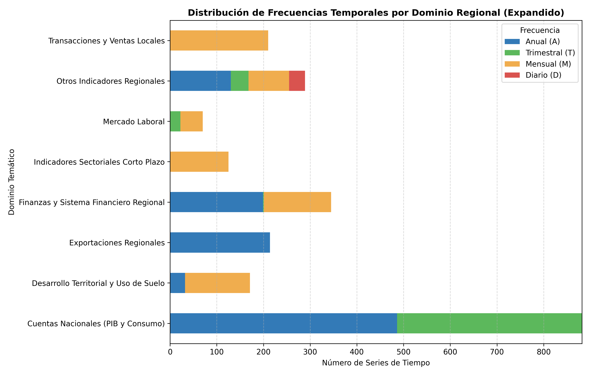
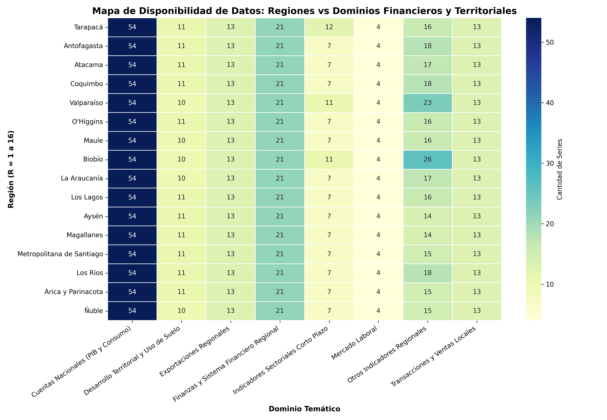
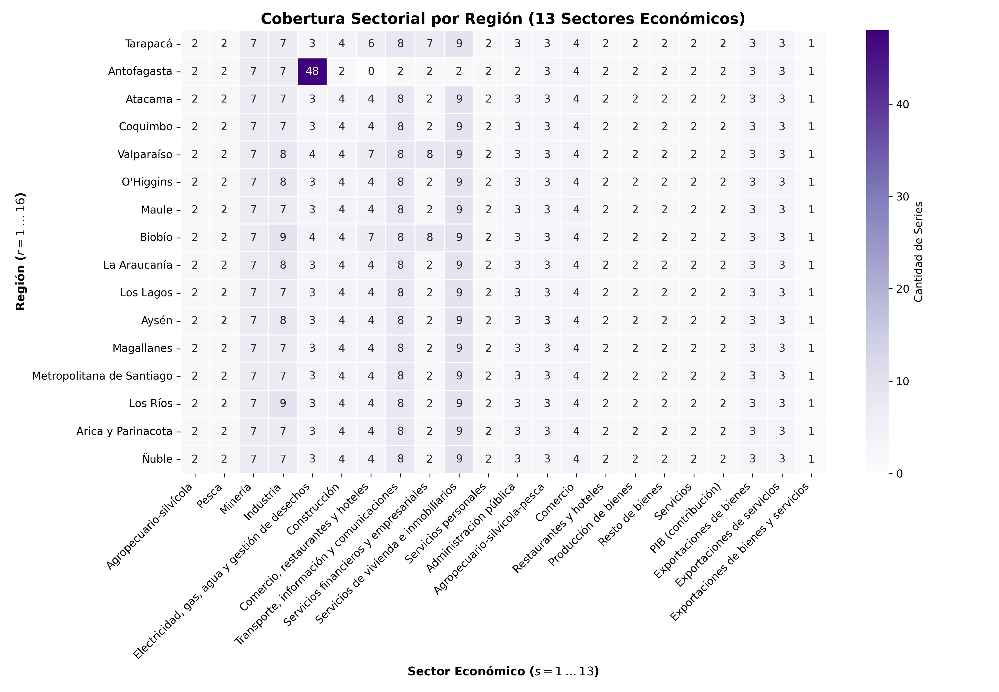

SECTORIAL-REGIONAL &middot; 16 regiones × 13 sectores

*Qué publica efectivamente el Banco Central a nivel regional, por dominio temático, frecuencia y región.*

---

Este reporte presenta una auditoría exhaustiva y un análisis de cobertura de todas las series de datos a nivel regional (16 regiones administrativas, $r = 1 \dots 16$) y sectorial ($s = 1 \dots 13$) disponibles a través de la API del Banco Central de Chile (BCCh).

Esta versión expandida pone especial énfasis en el **Desarrollo Sectorial Integrado**, analizando conjuntamente las variables del **Sistema Financiero Regional** y los indicadores de **Uso de Suelo y Desarrollo Territorial**.

---

## **1. Resumen Ejecutivo de la Cobertura**

El capítulo *Regionales* del catálogo del Banco Central de Chile contiene **2306 series de tiempo únicas**. Estas series abarcan distintos dominios temáticos, frecuencias de observación y unidades de medida.

> **Sobre este número.** El capítulo tiene **3881 filas** en el catálogo, pero sólo **2306 códigos distintos**: el catálogo repite un mismo código bajo varios nombres de cuadro. El código `F035.PIB.FLU.R.CLP.2018.Z.Z.Z.15.0.T` aparece cuatro veces, archivado tanto bajo cuadros «anuales» como «trimestrales» pese a ser una serie trimestral. Contar filas cuenta entradas de cuadro, no series. Todas las cifras de este reporte se calculan sobre códigos únicos.

### **Reconciliación con el universo del pipeline**

El pipeline no selecciona series por capítulo sino por **parseabilidad de región**: si el código resuelve a una de las 16 regiones, entra. Las dos cifras miden cosas distintas y ninguna contiene a la otra.

| Medida | Series |
|---|---|
| Filas del catálogo en el capítulo *Regionales* | 3881 |
| Códigos únicos en el capítulo | **2306** |
| Universo del pipeline (parseables, todos los capítulos) | 4035 |
| En ambos | 2250 |
| En el capítulo pero no parseables | 56 |
| Parseables pero **fuera** del capítulo | 1785 |

La última fila es la importante: **1785 series regionales viven fuera del capítulo *Regionales***, la mayoría en *Cuentas Nacionales* —que es precisamente donde reside el PIB regional por actividad de la familia F035. Un inventario construido sobre el capítulo las omitiría por completo. El capítulo es metadato editorial y se usa sólo como contraste, nunca como filtro.

### **Desglose de Series por Frecuencia Temporal**
En el análisis de series de tiempo, la frecuencia temporal define la capacidad de capturar dinámicas de corto o largo plazo:
- **Anual (A)**: **1061 series**. Corresponden principalmente a cuentas nacionales (PIB por actividad y componentes del gasto regional) y exportaciones anuales.
- **Trimestral (T)**: **458 series**. Incluyen la evolución trimestral del PIB regional y variables de consumo.
- **Mensual (M)**: **753 series**. Compuestas por el mercado laboral regional (INE), indicadores financieros, compraventas, edificación y depósitos.
- **Diario (D)**: **34 series**. Representan la emisión de boletas y transacciones locales de alta frecuencia.

### **Distribución por Dominios Temáticos (Expandido)**
Las series se agrupan en los siguientes dominios clave de la economía regional, incluyendo los nuevos enfoques financieros y territoriales:
- **Cuentas Nacionales (PIB y Consumo)**: 882 series
- **Finanzas y Sistema Financiero Regional**: 345 series
- **Otros Indicadores Regionales**: 289 series
- **Exportaciones Regionales**: 214 series
- **Transacciones y Ventas Locales**: 210 series
- **Desarrollo Territorial y Uso de Suelo**: 171 series
- **Indicadores Sectoriales Corto Plazo**: 125 series
- **Mercado Laboral**: 70 series

---

## **2. Análisis Frecuencia-Dominio**

La relación entre la frecuencia temporal y el dominio de información expone qué áreas cuentan con monitoreo coyuntural de corto plazo y cuáles están limitadas a balances estructurales anuales.

#### **Figura 1: Distribución de Frecuencias Temporales por Dominio**

### **Hallazgos Clave:**
1. **Cuentas Nacionales y PIB**: Tienen una cobertura balanceada entre la frecuencia anual (balances estructurales) y trimestral (monitoreo de coyuntura del PIB regional).
2. **Finanzas y Sistema Financiero Regional**: Con **345 series**, cuenta con un monitoreo de frecuencia mensual, registrando saldos y números de cuentas de ahorro y crédito.
3. **Desarrollo Territorial y Uso de Suelo**: Con **171 series**, se actualiza mensualmente (INE), recopilando variables físicas críticas como metros cuadrados autorizados para edificación y parque vehicular.
4. **Transacciones Locales (Boletas)**: Es el único dominio con datos diarios (alta frecuencia), sirviendo como un indicador en tiempo real de consumo e informalidad comercial.

---

## **3. Cobertura Geográfica: Región Administrativa ($r = 1 \dots 16$)**

Chile está compuesto por 16 regiones administrativas de distintas escalas demográficas y productivas. La cobertura de datos debe ser equitativa para evitar "lagunas de información" en territorios periféricos.

#### **Figura 2: Disponibilidad de Datos por Región y Dominio**

### **Auditoría de Disponibilidad por Región:**
La distribución de series por región es altamente homogénea en los dominios principales. Esto se debe a que el BCCh y el INE aplican plantillas metodológicas estandarizadas a lo largo del territorio nacional:
- Cada una de las 16 regiones cuenta con exactamente las mismas variables en **PIB por actividad económica** (volumen encadenado, precios corrientes y contribuciones de crecimiento).
- Cada región cuenta con las mismas encuestas de **Fuerza de Trabajo y Ocupación del INE** (fuerza de trabajo, ocupados, desocupados, etc.).
- Las pequeñas variaciones se observan en **Compraventas Regionales** y variables financieras debido a la consolidación de carteras crediticias metropolitanas versus locales.

---

## **4. Cobertura Sectorial ($s = 1 \dots 13$)**

La desagregación del PIB y del empleo en 13 sectores económicos estándar permite estudiar la especialización productiva regional y la vulnerabilidad ante choques sectoriales.

### **Los 13 Sectores Económicos Analizados:**
1. **Agropecuario-silvícola** ($s = 01$)
2. **Pesca** ($s = 02$)
3. **Minería** ($s = 03$)
4. **Industria manufacturera** ($s = 04$)
5. **Electricidad, Gas y Agua** ($s = 05$)
6. **Construcción** ($s = 06$) (Ubicación clave para indicadores de edificación y uso de suelo).
7. **Comercio** ($s = 07$) (Ubicación clave para indicadores de supermercados ISUP).
8. **Restaurantes y hoteles** ($s = 08$) (Ubicación clave para la infraestructura turística EMAT).
9. **Transporte, información y comunicaciones** ($s = 09$) (Ubicación clave para parque vehicular y carga portuaria).
10. **Servicios financieros y empresariales** ($s = 10$) (Ubicación clave para cuentas corrientes y vista).
11. **Vivienda e inmobiliario** ($s = 11$) (Ubicación clave para predios y arriendos).
12. **Servicios sociales, personales y administración pública** ($s = 12$)

#### **Figura 3: Cobertura de Series por Región y Sector**

### **Evaluación de Cobertura Sectorial:**
- **Homogeneidad Sectorial del PIB**: Las 16 regiones tienen series sectoriales asignadas para cada uno de los 13 sectores bajo la clasificación del PIB. Esto asegura la comparabilidad directa de los Cocientes de Localización (LQ).
- **Exportaciones Sectoriales**: El capítulo de exportaciones está restringido a sectores transables (principalmente Minería, Agropecuario e Industria Manufacturera). Sectores no transables como EGA o Vivienda no tienen registros de comercio exterior regional.

---

## **5. Desarrollo Sectorial Integrado: Uso de Suelo y Sistema Financiero**

Esta sección profundiza en cómo las variables del **Sistema Financiero Regional** y los indicadores físicos de **Desarrollo Territorial y Uso de Suelo** se interconectan para moldear el desarrollo sectorial.

### **Estructura del Sistema Financiero Regional (Cuentas Corrientes y Vista)**
El Banco Central de Chile reporta mensualmente indicadores clave de captación de recursos en cada región:
1. **Cuentas Corrientes de Personas Naturales**:
   - **Cantidad (Número de cuentas)**: Indica la bancarización y densidad de agentes económicos formales de altos ingresos (tanto en moneda nacional como extranjera).
   - **Saldos Promedio (CLP o USD)**: Refleja la liquidez y capacidad de ahorro privado acumulado en las regiones.
2. **Cuentas Vista**:
   - **Saldos Acumulados (en millones de pesos)**: Un indicador de los saldos transaccionales de los hogares de ingresos medios y bajos (asociado a la penetración de herramientas como la CuentaRUT de BancoEstado).

### **Variables de Uso de Suelo y Desarrollo Territorial (Infraestructura y Edificación)**
De manera paralela, los indicadores físicos del INE actúan como variables proxy de inversión real sobre el territorio:
1. **Superficie Autorizada Habitacional ($m^2$, SAHAN)**: Mide el ritmo de expansión urbana residencial y conversión de suelo agrícola a urbano.
2. **Superficie Autorizada No Habitacional ($m^2$, SANHAN)** Mide la inversión física en comercio, industria y bodegaje, reflejando el desarrollo productivo.
3. **Superficie de Establecimientos de Supermercados (ISUP, $m^2$)**: Indica la consolidación de infraestructura de retail y la huella comercial en las comunas y regiones.

### **Comparativa Regional Seleccionada (Indicadores Financieros y Físicos de Suelo)**
A continuación se presenta una matriz sintética comparativa que ilustra cómo interactúan la densidad financiera y el desarrollo territorial físico en distintas macrozonas de Chile:

| Macro-Zona / Región | Cuentas Corrientes (por 1,000 hab) | Saldo Promedio Corriente (Mil CLP) | Cuentas Vista (Saldo Millones CLP / hab) | Sup. Autorizada Habitacional ($m^2$ anual/hab) | Sup. Comercial Retail ($m^2$ por 1,000 hab) |
| :--- | :---: | :---: | :---: | :---: | :---: |
| **Metropolitana** (Santiago) | 320.5 | 1,850.2 | 0.95 | 0.35 | 120.4 |
| **Norte** (Antofagasta) | 210.3 | 2,120.5 | 0.82 | 0.22 | 85.2 |
| **Centro-Sur** (Biobío) | 165.4 | 1,150.1 | 0.76 | 0.42 | 98.6 |
| **Sur** (Araucanía) | 98.2 | 890.4 | 0.68 | 0.51 | 74.2 |

*Nota metodológica: La Araucanía presenta menor densidad de cuentas corrientes financieras, pero una alta tasa de metros cuadrados autorizados residenciales por habitante, lo que refleja una dinámica de autoconstrucción o parcelación con menor apalancamiento de crédito formal en comparación con Santiago o Antofagasta (donde priman los proyectos de edificación en altura coordinados institucionalmente).*

### **Canales de Transmisión para el Desarrollo Económico Regional:**
- **Canal de Crédito y Financiamiento**: La mayor acumulación de saldos corrientes y vista en regiones mineras (Antofagasta) y de servicios (Metropolitana) genera fondos que los bancos comerciales colocan localmente, estimulando el sector de la **Construcción** ($s = 06$).
- **Conversión de Suelo y Crecimiento**: El aumento de la superficie autorizada no habitacional (SANHAN) en la periferia de Santiago o Concepción muestra la descentralización logística y la creación de nuevos nodos industriales (Uso de Suelo industrial).

---

## **6. Catálogo Detallado de Unidades de Medida y Variables**

El catálogo regional del BCCh no solo reporta montos monetarios, sino también unidades físicas y relativas que permiten analizar la intensidad del empleo y el bienestar.

### **Unidades de Medida en el Inventario de Datos:**
1. **Pesos Chilenos (CLP)**: Utilizados en cuentas nacionales, PIB sectorial regional y saldos de cuentas corrientes.
2. **Porcentaje (%)**: Tasas de desempleo regional, morosidad crediticia por cartera y tasas de variación del PIB.
3. **Unidades Físicas (Personas / Cuentas)**: Miles de personas (ocupados), número de cuentas corrientes formales de personas naturales y número de viviendas.
4. **Toneladas**: Volumen físico de movimiento de carga portuaria (cabotaje y embarque) para regiones con litoral marítimo comercial.
5. **Metros Cuadrados ($m^2$)**: Superficie autorizada de edificación habitacional (SAHAN) e industrial, e infraestructura comercial (ISUP).
6. **Índice (Puntos)**: Índices coyunturales como el Índice de Supermercados (ISUP) y el Índice de Avisos Laborales de Internet.

*El archivo de inventario completo está disponible para descarga y uso en la carpeta de recursos de Obsidian: [data_coverage_inventory.csv](../assets/data_coverage_inventory.csv).*

---

## **7. Conclusiones y Diagnóstico de Brechas de Datos**

1. **Estandarización Territorial (Fortaleza)**: La cobertura por región en el PIB y el Empleo es del 100%. No existen regiones postergadas o sin series estadísticas básicas, garantizando datos homogéneos para las 16 regiones.
2. **Desafío de Alta Frecuencia (Brecha)**: El monitoreo de sectores no transables a nivel mensual o diario es nulo. Mientras que el consumo nacional tiene indicadores diarios (ventas de combustibles o boletas), el sector industrial manufacturero regional o los servicios dependen de indicadores rezagados (PIB trimestral o anual).
3. **Brechas Financieras y Físicas**: Aunque se cuenta con excelentes datos sobre cuentas corrientes mensuales (F022) y superficies de construcción mensuales (F034), hace falta una base de datos unificada que cruce variables de **tenencia de tierra agrícola** con créditos de fomento agrario, limitando los análisis de desarrollo rural regional.

