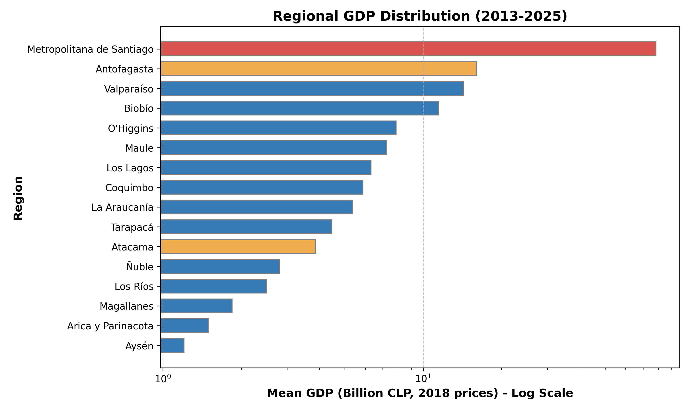
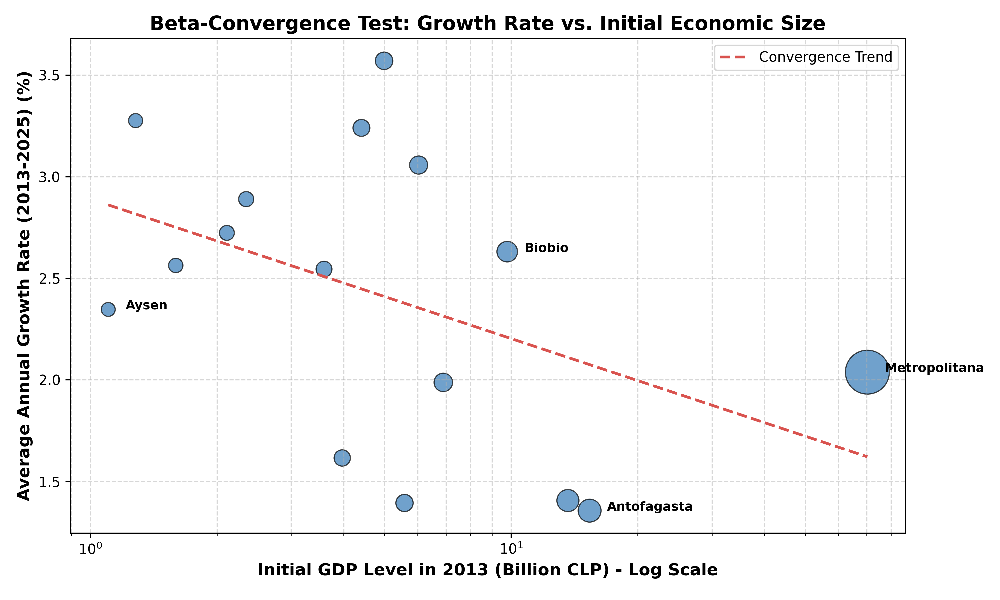
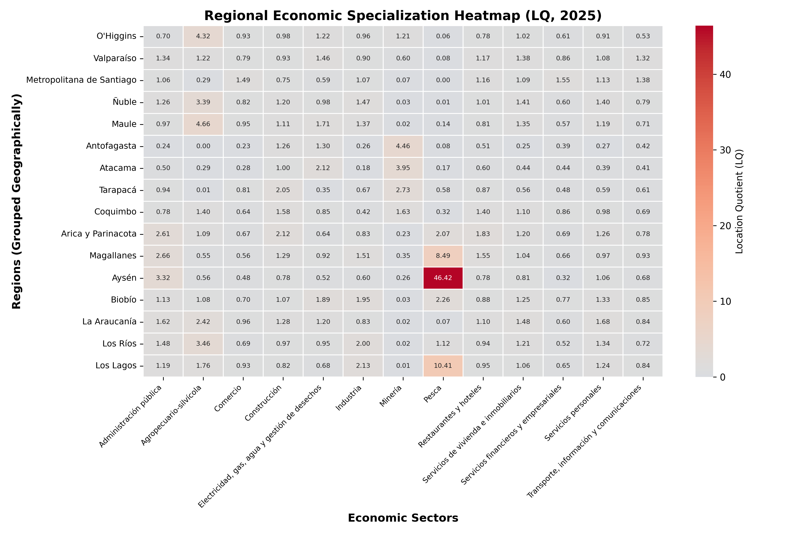
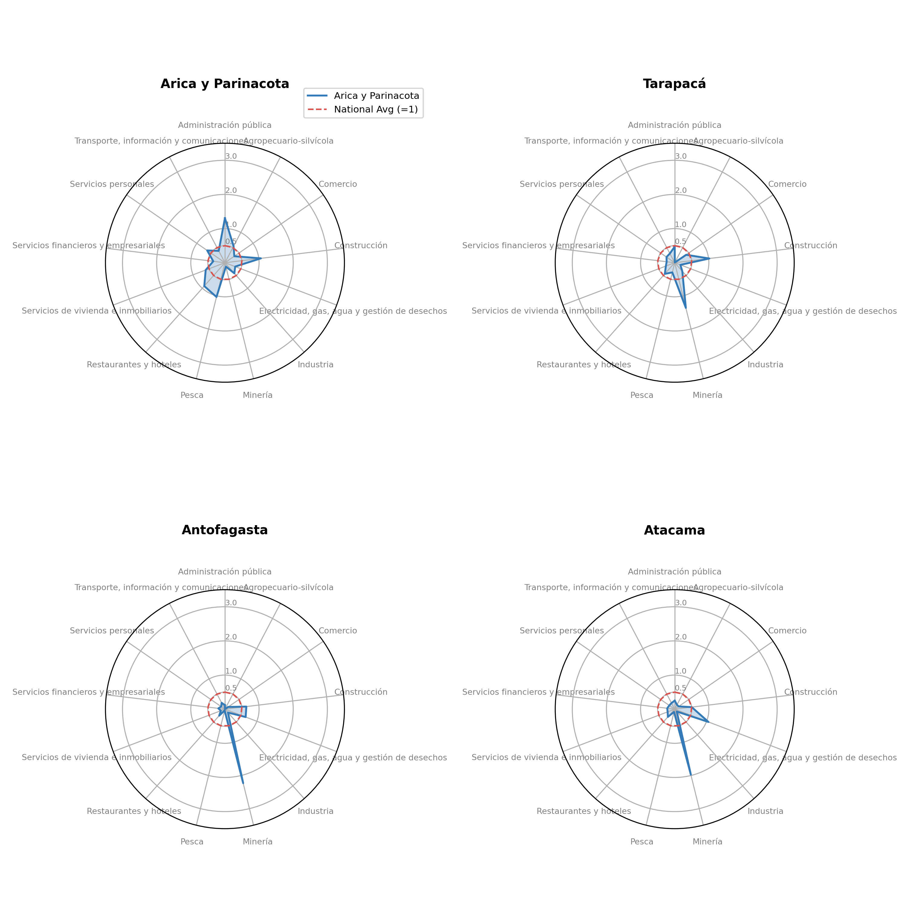
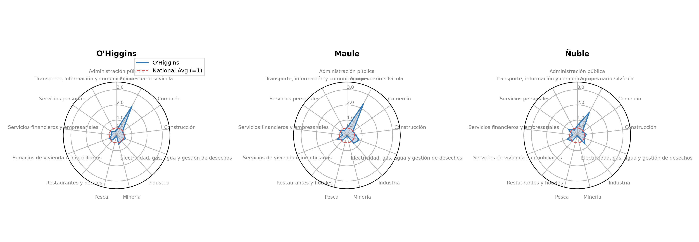
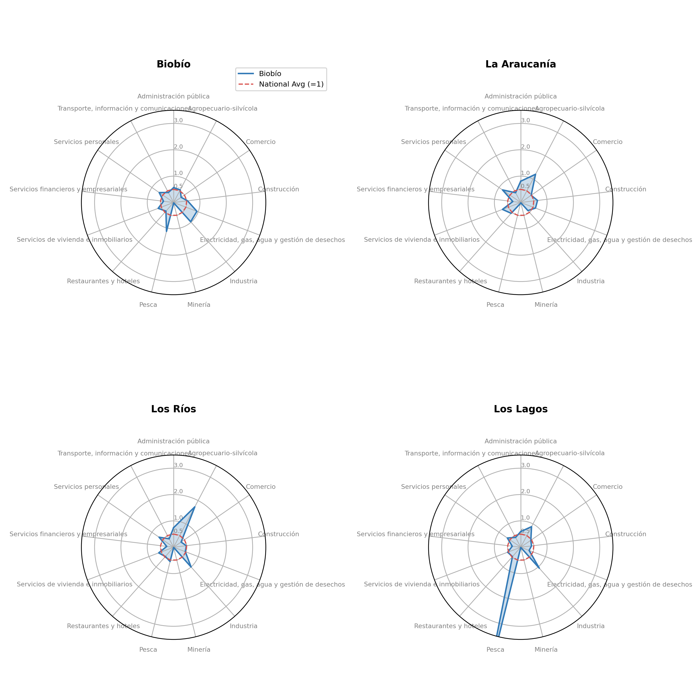
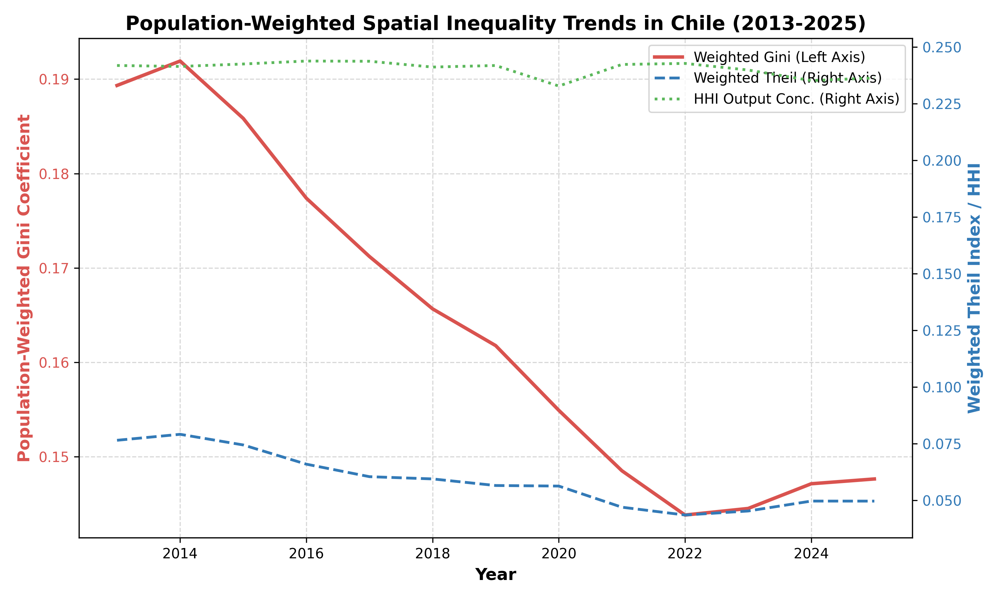

SECTORIAL-REGIONAL &middot; 16 regiones × 13 sectores

*La geografía productiva de Chile está estructuralmente fijada, mientras que la desigualdad de bienestar apenas oscila con los ciclos de commodities.*

---

## **1. Introducción**

Chile se caracteriza históricamente por una alta centralización económica y desigualdad espacial. Este informe presenta un análisis descriptivo de las disparidades económicas regionales en Chile durante el período 2013-2025, utilizando cifras anuales del PIB regional de la base de datos estadística del Banco Central de Chile (BCCh) (medidas en volumen encadenado, año de referencia 2018). El conjunto de datos cubre las 16 regiones administrativas de Chile, rastreando su producción económica, dinámicas de crecimiento, patrones de especialización sectorial e índices de desigualdad espacial.

---

## **2. Sección 1: Tamaño Económico Regional y Dinámicas de Crecimiento**

La Tabla 1 resume los parámetros clave de la producción económica de las 16 regiones chilenas. La dominancia de la Región Metropolitana es clara, representando el 45.9% del PIB nacional, seguida de regiones con fuerte actividad minera como Antofagasta. 

### **Tabla 1: Estadísticas Resumidas del Producto Económico Regional (2013-2025)**

| Región | PIB Promedio (Miles de Millones de CLP) | Participación en el PIB Nacional (%) | Tasa de Crecimiento Anual Promedio (%) | Volatilidad del Producto (Desv. Est.) |
| :--- | :---: | :---: | :---: | :---: |
| Metropolitana de Santiago | 78.49 | 45.92% | 2.04% | 4.79 |
| Antofagasta | 16.00 | 9.39% | 1.36% | 4.20 |
| Valparaíso | 14.26 | 8.35% | 1.41% | 4.07 |
| Biobío | 11.45 | 6.69% | 2.63% | 3.49 |
| O'Higgins | 7.86 | 4.60% | 1.99% | 3.98 |
| Maule | 7.22 | 4.21% | 3.06% | 3.61 |
| Los Lagos | 6.31 | 3.68% | 3.57% | 3.69 |
| Coquimbo | 5.87 | 3.44% | 1.39% | 3.78 |
| La Araucanía | 5.36 | 3.12% | 3.24% | 3.90 |
| Tarapacá | 4.46 | 2.61% | 1.62% | 4.83 |
| Atacama | 3.85 | 2.26% | 2.54% | 5.81 |
| Ñuble | 2.80 | 1.63% | 2.89% | 4.33 |
| Los Ríos | 2.50 | 1.46% | 2.72% | 3.35 |
| Magallanes | 1.84 | 1.08% | 2.56% | 5.37 |
| Arica y Parinacota | 1.49 | 0.87% | 3.28% | 5.48 |
| Aysén | 1.21 | 0.71% | 2.35% | 5.71 |

### **Figuras Correspondientes**

#### **Figura 1.1: Distribución del PIB Regional - La Dominancia de Santiago**

*La Figura 1.1 destaca la enorme discrepancia de tamaño entre la Región Metropolitana (resaltada en rojo) y todas las demás regiones. Las regiones mineras basadas en recursos primarios como Antofagasta (naranja) la siguen, pero aún operan a una fracción de la escala de producción de la capital.*

#### **Figura 1.2: Crecimiento vs. Tamaño - Patrones de Convergencia**

*La Figura 1.2 prueba la convergencia $\beta$. La teoría neoclásica del crecimiento sugiere que las regiones más pobres (con menor PIB inicial en 2013) deberían crecer más rápido que las ricas, produciendo una línea de tendencia con pendiente negativa. En Chile, esta relación es débilmente negativa pero está fuertemente distorsionada por economías mineras de alto crecimiento (como Antofagasta) y regiones rurales estancadas.*

---

## **3. Sección 2: Especialización Económica Regional (Decomposición en 13 Sectores)**

Los Cocientes de Localización (LQ) revelan qué tan especializada está una región en un sector particular en relación con el promedio nacional. Un LQ mayor que 1.0 indica que la participación de un sector en la producción regional es mayor que su participación en la economía nacional. Esta sección aprovecha la clasificación oficial de PIB regional de 13 sectores compilada por el Banco Central de Chile para extraer la composición estructural de los territorios.

### **Formalización Metodológica**

El Cociente de Localización ($LQ_{i,s}$) para la región $i$ y el sector $s$ se formaliza como:
$$LQ_{i,s} = \frac{Y_{i,s} / Y_i}{Y_{\text{nat},s} / Y_{\text{nat}}}$$
donde:
- $Y_{i,s}$ es el PIB del sector $s$ en la región $i$,
- $Y_i = \sum_{s=1}^m Y_{i,s}$ es el PIB total de la región $i$ a través de los $m$ sectores,
- $Y_{\text{nat},s} = \sum_{j=1}^n Y_{j,s}$ es el PIB nacional del sector $s$ a través de las $n$ regiones,
- $Y_{\text{nat}} = \sum_{j=1}^n \sum_{k=1}^m Y_{j,k}$ es el PIB nacional total.

### **Tabla 2: Cocientes de Localización (LQ) por Región y Sector (2025 - 13 Sectores)**

| Región | AdmPub | Agro | Comercio | Const | EGA | Manuf | Minería | Pesca | Hoteles | Inmob | Finan | Personales | Transp |
| :--- | :---: | :---: | :---: | :---: | :---: | :---: | :---: | :---: | :---: | :---: | :---: | :---: | :---: |
| **Antofagasta** | 0.24 | 0.00 | 0.23 | 1.26 | 1.30 | 0.26 | 4.46 | 0.08 | 0.51 | 0.25 | 0.39 | 0.27 | 0.42 |
| **La Araucanía** | 1.62 | 2.42 | 0.96 | 1.28 | 1.20 | 0.83 | 0.02 | 0.07 | 1.10 | 1.48 | 0.60 | 1.68 | 0.84 |
| **Arica y Parinacota** | 2.61 | 1.09 | 0.67 | 2.12 | 0.64 | 0.83 | 0.23 | 2.07 | 1.83 | 1.20 | 0.69 | 1.26 | 0.78 |
| **Atacama** | 0.50 | 0.29 | 0.28 | 1.00 | 2.12 | 0.18 | 3.95 | 0.17 | 0.60 | 0.44 | 0.44 | 0.39 | 0.41 |
| **Aysén** | 3.32 | 0.56 | 0.48 | 0.78 | 0.52 | 0.60 | 0.26 | 46.42 | 0.78 | 0.81 | 0.32 | 1.06 | 0.68 |
| **Biobío** | 1.13 | 1.08 | 0.70 | 1.07 | 1.89 | 1.95 | 0.03 | 2.26 | 0.88 | 1.25 | 0.77 | 1.33 | 0.85 |
| **Coquimbo** | 0.78 | 1.40 | 0.64 | 1.58 | 0.85 | 0.42 | 1.63 | 0.32 | 1.40 | 1.10 | 0.86 | 0.98 | 0.69 |
| **Los Lagos** | 1.19 | 1.76 | 0.93 | 0.82 | 0.68 | 2.13 | 0.01 | 10.41 | 0.95 | 1.06 | 0.65 | 1.24 | 0.84 |
| **Los Ríos** | 1.48 | 3.46 | 0.69 | 0.97 | 0.95 | 2.00 | 0.02 | 1.12 | 0.94 | 1.21 | 0.52 | 1.34 | 0.72 |
| **Magallanes** | 2.66 | 0.55 | 0.56 | 1.29 | 0.92 | 1.51 | 0.35 | 8.49 | 1.55 | 1.04 | 0.66 | 0.97 | 0.93 |
| **Maule** | 0.97 | 4.66 | 0.95 | 1.11 | 1.71 | 1.37 | 0.02 | 0.14 | 0.81 | 1.35 | 0.57 | 1.19 | 0.71 |
| **Metropolitana de Santiago** | 1.06 | 0.29 | 1.49 | 0.75 | 0.59 | 1.07 | 0.07 | 0.00 | 1.16 | 1.09 | 1.55 | 1.13 | 1.38 |
| **Ñuble** | 1.26 | 3.39 | 0.82 | 1.20 | 0.98 | 1.47 | 0.03 | 0.01 | 1.01 | 1.41 | 0.60 | 1.40 | 0.79 |
| **O'Higgins** | 0.70 | 4.32 | 0.93 | 0.98 | 1.22 | 0.96 | 1.21 | 0.06 | 0.78 | 1.02 | 0.61 | 0.91 | 0.53 |
| **Tarapacá** | 0.94 | 0.01 | 0.81 | 2.05 | 0.35 | 0.67 | 2.73 | 0.58 | 0.87 | 0.56 | 0.48 | 0.59 | 0.61 |
| **Valparaíso** | 1.34 | 1.22 | 0.79 | 0.93 | 1.46 | 0.90 | 0.60 | 0.08 | 1.17 | 1.38 | 0.86 | 1.08 | 1.32 |

### **Figuras Correspondientes**

#### **Figura 2.1: Mapa de Calor de Especialización en 13 Sectores**

*El mapa de calor expone inmediatamente las identidades económicas geográficas de Chile a través de los 13 sectores económicos. Destaca el norte predominantemente minero, el centro orientado a los servicios y el sur silvoagropecuario y pesquero.*

#### **Figura 2.2: Gráficos de Radar de Especialización Regional por Macro-Zona (Decomposición de 13 Sectores)**

Agrupamos los gráficos de radar regionales por macrozonas geográficas para exponer estructuras regionales compartidas y clusters territoriales:

##### **1. Macro-Zona Norte (Núcleo Minero)**

*La Figura 2.2a detalla la macrozona Norte (*Arica y Parinacota, Tarapacá, Antofagasta, Atacama*). Se caracteriza por una fuerte especialización en Minería, con Antofagasta mostrando un cociente minero masivo ($LQ > 5.0$). Las regiones del norte con menor producción como Arica muestran un sesgo hacia la administración pública y los servicios sociales, mientras que los sectores agrícolas son prácticamente inexistentes debido al clima desértico.*

##### **2. Macro-Zona Centro (Centro de Servicios y Conectividad)**

*La Figura 2.2b perfila la macrozona Centro (*Coquimbo, Valparaíso, Metropolitana*). La Región Metropolitana muestra una alta concentración en Servicios y Actividades Financieras ($LQ > 1.5$), operando como el centro de negocios del país. Valparaíso equilibra el transporte y comercio portuario con el turismo (Servicios y Comercio). Coquimbo representa una zona de transición, combinando la minería en los valles interiores con la actividad agrícola.*

##### **3. Macro-Zona Centro Sur (Corazón Agrícola-Industrial)**

*La Figura 2.2c muestra la macrozona Centro Sur (*O'Higgins, Maule, Ñuble, Biobío*). Biobío actúa como el motor industrial con una especialización manufacturera significativa ($LQ > 1.5$), mientras que Maule y Ñuble muestran una fuerte concentración en Agricultura y Silvoagropecuario ($LQ > 2.5$). O'Higgins presenta un carácter dual, combinando la extracción de cobre con la agricultura frutícola.*

##### **4. Macro-Zona Sur (Corazón Silvoagropecuario y Acuícola)**

*La Figura 2.2d muestra la macrozona Sur (*Araucanía, Los Ríos, Los Lagos*). Los Lagos está fuertemente especializada en Pesca y Acuicultura ($LQ > 5.5$) debido a la industria del salmón. La Araucanía presenta una fuerte presencia de Agricultura y Servicios Personales/Sociales.*

##### **5. Macro-Zona Austral (Enclaves de Recursos Primarios y Servicios Públicos en Zonas Aisladas)**

*La Figura 2.2e captura la macrozona Austral (*Aysén, Magallanes*). Ambas regiones muestran altas participaciones de servicios sociales debido al empleo público en zonas aisladas. Los recursos primarios siguen siendo muy relevantes, particularmente el petróleo y gas en Magallanes, y la pesca/ganadería en Aysén.*

---

## **4. Sección 3: Evolución de la Desigualdad Espacial (Ponderada por Población)**

Para evaluar la desigualdad espacial del bienestar entre los ciudadanos en lugar de la simple densidad de producción, calculamos índices **ponderados por población** sobre el PIB regional per cápita a lo largo del tiempo. Evaluar las disparidades espaciales sin ponderar por la masa demográfica puede sesgar los resultados, sobrerrepresentando a regiones pequeñas (p. ej., Aysén, con 100 mil habitantes) frente a grandes centros demográficos (p. ej., Metropolitana, con 7.5 millones).

### **Formalización Metodológica**

1. **Coeficiente de Gini Ponderado por Población ($G_w$)**:
   Mide la distancia promedio entre todos los pares de PIB regional per cápita, ponderada por sus respectivas participaciones de población:
   $$G_w = \frac{1}{2\bar{y}} \sum_{i=1}^n \sum_{j=1}^n s_i s_j |y_i - y_j|$$
   donde $y_i$ es el PIB per cápita de la región $i$, $s_i = \frac{p_i}{P}$ es la participación de población de la región $i$ (con población regional $p_i$ y población nacional $P = \sum p_i$), y $\bar{y} = \sum_{i=1}^n s_i y_i$ es el promedio nacional del PIB per cápita.

2. **Índice de Theil Ponderado por Población ($T_w$)**:
   El índice de Theil captura la entropía de la distribución del ingreso regional, representando la dispersión del PIB per cápita regional ponderada demográficamente:
   $$T_w = \sum_{i=1}^n s_i \left( \frac{y_i}{\bar{y}} \right) \ln\left( \frac{y_i}{\bar{y}} \right)$$

3. **Índice de Herfindahl-Hirschman (HHI) para Concentración de la Producción**:
   El HHI evalúa la concentración bruta de la actividad económica nacional (PIB regional total, no per cápita) entre los 16 territorios administrativos:
   $$HHI = \sum_{i=1}^n x_i^2$$
   donde $x_i = \frac{Y_i}{\sum Y_i}$ es la participación del PIB de la región $i$ ($Y_i$) en el total nacional. Los valores del HHI varían desde $1/n = 0.0625$ (distribución perfectamente equitativa de la producción) hasta $1.0$ (concentración total).

### **Tabla 3: Índices de Desigualdad Espacial Ponderados por Población en el Tiempo (PIB per cápita)**

| Año | Coeficiente de Gini | Índice de Theil | HHI (Concentración de la Producción) |
| :---: | :---: | :---: | :---: |
| 2013 | 0.1893 | 0.0765 | 0.2419 |
| 2015 | 0.1858 | 0.0744 | 0.2426 |
| 2017 | 0.1712 | 0.0604 | 0.2438 |
| 2019 | 0.1618 | 0.0565 | 0.2419 |
| 2021 | 0.1485 | 0.0469 | 0.2424 |
| 2023 | 0.1445 | 0.0452 | 0.2399 |
| 2025 | 0.1476 | 0.0496 | 0.2364 |

*Nota: Una versión en formato CSV de la Tabla 3 está disponible en [table3_spatial_inequality.csv](../assets/table3_spatial_inequality.csv).*

### **Figuras Correspondientes**

#### **Figura 3.1: Tendencias de Desigualdad Espacial Ponderada por Población (2013-2025)**

*La Figura 3.1 traza la trayectoria a largo plazo de la desigualdad regional en Chile. A diferencia de la concentración bruta de la producción, que permanece estructuralmente rígida, la desigualdad basada en el PIB regional per cápita muestra una variabilidad temporal significativa:
1. **La Corrección Post-Boom (2013-2016)**: Los índices de Gini y Theil disminuyeron de manera constante a medida que los precios del cobre se normalizaron, reduciendo la brecha entre los enclaves de recursos y el resto del país.
2. **La Recuperación Económica 2017-2018**: Ocurrió una divergencia debido a diferentes ritmos de recuperación entre las regiones industriales y primarias.
3. **El Choque del COVID-19 en 2020**: Las dinámicas regionales divergieron marcadamente, reflejando el impacto localizado de los confinamientos.*

#### **Figura 3.2: Evolución de la Participación en el PIB Regional - Área Apilada**

*El gráfico de área apilada demuestra la rigidez estructural de la geografía económica de Chile. La Región Metropolitana (capa inferior) mantiene una participación constante y pesada de la producción durante todo el período de 13 años.*

### **Interpretación de Tendencias de Desigualdad y Dinámicas Regionales**

La comparación entre la concentración bruta de la producción (HHI) y los índices de desigualdad ponderados por población (Gini y Theil) expone características estructurales clave de la geografía económica de Chile:

1. **Rigidez Estructural de la Producción (HHI)**:
   El HHI se mantiene prácticamente plano, oscilando entre **0.2364** y **0.2438** durante todo el período 2013-2025. Esto indica que la concentración geográfica de la producción bruta está estructuralmente bloqueada. La Región Metropolitana y los centros mineros del norte siguen capturando exactamente las mismas proporciones de la producción económica nacional, sin mostrar señales de descentralización territorial.

2. **Volatilidad Temporal del Bienestar (Gini y Theil)**:
   A diferencia de la rigidez del HHI, el Gini y Theil ponderados por población muestran ciclos temporales claros impulsados por choques macroeconómicos nacionales:
   - **La Corrección Post-Boom de Commodities (2013–2016)**: El Gini ponderado disminuyó de **0.1893** en 2013 a **0.1476** en 2025 (y el Theil de **0.0765** a **0.0496**). Al normalizarse los precios del cobre tras el súper-ciclo, la brecha de PIB per cápita entre las regiones ricas en recursos (como Antofagasta) y las regiones agrícolas o de servicios se comprimió. Esto representa una "convergencia pasiva" por normalización de rentas y no por un catch-up estructural de los sectores rezagados.
   - **La Compresión por el COVID-19 en 2020**: El Gini ponderado alcanzó su mínimo en 2023, en **0.1445** (Theil en **0.0452**). Esta anomalía refleja el impacto desigual de las cuarentenas. Los centros urbanos basados en servicios (como Santiago) enfrentaron cierres severos que contrajeron su producción, mientras que los sectores primarios (minería en el Norte) se mantuvieron activos al ser catalogados como estratégicos. Esto redujo temporalmente la brecha de ingresos entre la capital y las regiones periféricas.
   - **Rebote Post-Pandemia (2021–2025)**: Con la reapertura de los servicios y los ciclos de inflación global, el Gini se situó en **0.1476** hacia 2025 (Theil en **0.0496**), demostrando que las disparidades espaciales subyacentes regresan a sus niveles históricos una vez que se normaliza el ciclo económico.

3. **Implicancia de Política Pública**:
   La divergencia entre una concentración constante de la producción (HHI) y variables de bienestar fluctuantes (Gini/Theil) sugiere que los ciclos de commodities y choques temporales mueven los indicadores per cápita temporalmente, pero no resuelven el centralismo espacial persistente en Chile. Reducir la desigualdad requiere políticas industriales activas y de diversificación productiva dirigidas a sectores de alto valor fuera de la Región Metropolitana.

---

## **5. Conclusiones e Implicancias de Política**

1. **Centralización Persistente**: La Región Metropolitana continúa dominando el panorama económico, capturando consistentemente el 45.9% del PIB nacional. No existe evidencia visual ni estadística de una descentralización importante.
2. **Débil Cohesión**: El gráfico de convergencia demuestra que las regiones rurales y periféricas no están alcanzando al centro. El crecimiento sigue estando impulsado por enclaves de recursos específicos (Minería en el Norte).
3. **Implicancias de Política**: Las estrategias de desarrollo regional deben ir más allá de los subsidios generales y enfocarse en construir capacidades productivas locales. Fortalecer las especializaciones sectoriales (por ejemplo, clusters agrícolas en el Sur) mientras se fomenta la complejidad económica es clave para mitigar la dependencia de la extracción de recursos primarios y los servicios centrales.

