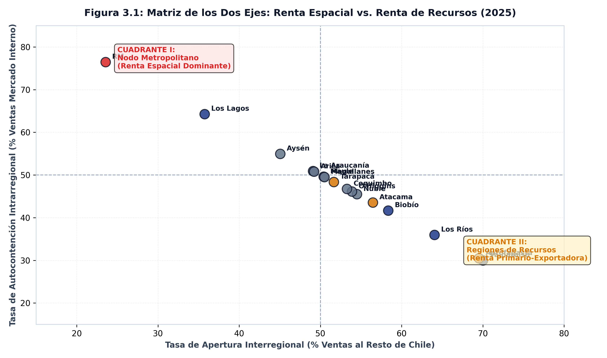

SECTORIAL-REGIONAL &middot; 16 regiones × 13 sectores

*La renta espacial es difusa y creciente; la renta de recursos es concentrada y se endurece. Son dos geografías distintas dentro del mismo país.*

---

## El argumento

El marco de crecimiento desbalanceado distingue dos rentas que compiten por el excedente de una economía: la **renta espacial**, que se captura sobre el suelo y el inmueble, y la **renta de recursos**, que se captura sobre el subsuelo. En las cuentas regionales del Banco Central ambas tienen una contraparte directa: el sector **10** (*Servicios de vivienda e inmobiliarios*) y el sector **03** (*Minería*). El sector **06** (*Construcción*) es la pata de inversión que las vincula.

::: {.callout-warning}
### Nota Metodológica sobre la Proxy de Renta Espacial
Se aclara explícitamente que la participación sectorial en el PIB regional no es necesariamente una proxy perfecta de la renta espacial urbana del suelo, pero constituye una primera aproximación empírica admisible con los datos disponibles en la Base de Datos Estadísticos (BDE) del Banco Central de Chile. La distinción entre la plusvalía de la localización y el costo de las estructuras físicas se profundiza a escala nacional en el Reporte 5.
:::

::: {.caveat}
**El sector 10 es mayoritariamente renta imputada.** Las cuentas nacionales incluyen el alquiler imputado de las viviendas ocupadas por sus propietarios. Es la mejor aproximación disponible —el catálogo del Banco Central no contiene ningún índice de arriendos regional— pero es un supuesto que sostiene todo el eje espacial.
:::

## Lo que muestran los datos

Entre 2013 y 2025 la participación media de la **renta espacial** en el producto regional pasó de **7,91%** a **8,66%**. La participación media de la **renta de recursos** pasó de **14,08%** a **14,13%** —es decir, se mantuvo prácticamente donde estaba.

El promedio, sin embargo, es lo menos interesante. Lo decisivo es cómo se *reparte* cada eje entre regiones:

- El Gini regional de la renta espacial se movió de **0,1498** a **0,1798**. Es un valor bajo: la renta espacial existe en todas partes.
- El Gini regional de la renta de recursos se movió de **0,6332** a **0,6956**. Es un valor alto *y creciente*: la minería no sólo está concentrada, se está concentrando más.

En 2025 las regiones con mayor participación de renta espacial fueron La Araucanía (12,3%); Ñuble (11,8%); Valparaíso (11,5%). Las de mayor renta de recursos fueron Antofagasta (64,5%); Atacama (57,2%); Tarapacá (39,4%).

::: {.callout-note}
### Medición de la Matriz Bi-Axial de Rentas (Figura 3.1)
La matriz ubica a las 16 regiones según su grado de apertura externa (eje de recursos/comercio) y su grado de autocontención interna (eje espacial metropolitano). Aísla el contraste entre la Región Metropolitana (nodo autocontenido de consumo final) y las regiones minero-exportadoras del norte.
:::

## Por qué importa

Las dos rentas no se distribuyen como se distribuye el producto. La renta espacial acompaña a la población: donde hay gente hay vivienda, y donde hay vivienda hay sector 10. La renta de recursos acompaña a la geología, que no se redistribuye nunca.

::: {.fuente}
**Fuente:** elaboración propia (2026) en base a la Base de Datos Estadísticos del Banco Central de Chile. Datos: [`panel_two_axes_annual.csv`](../datos/panel_two_axes_annual.csv).
:::

