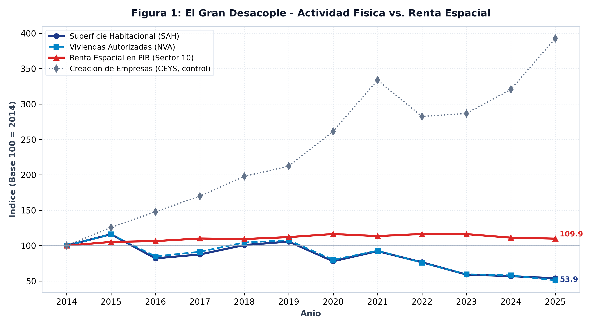
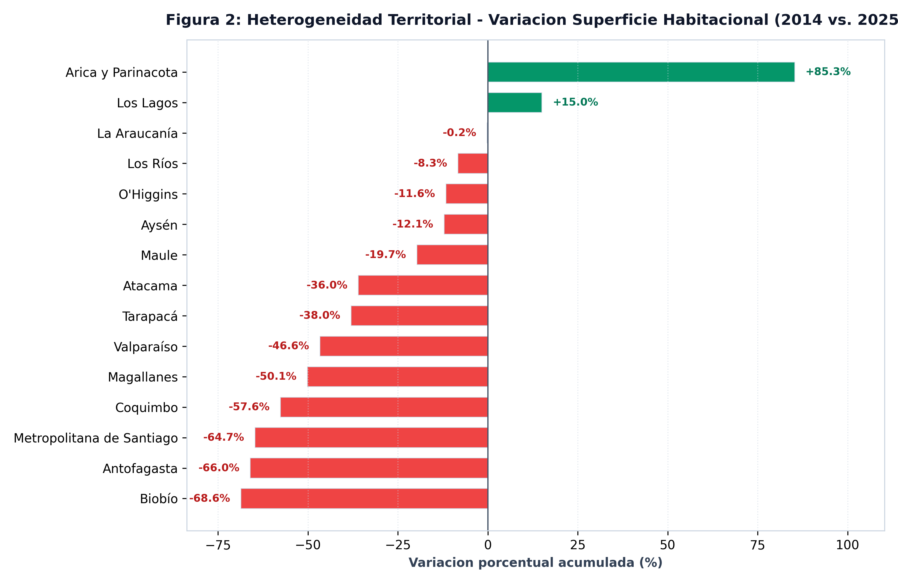
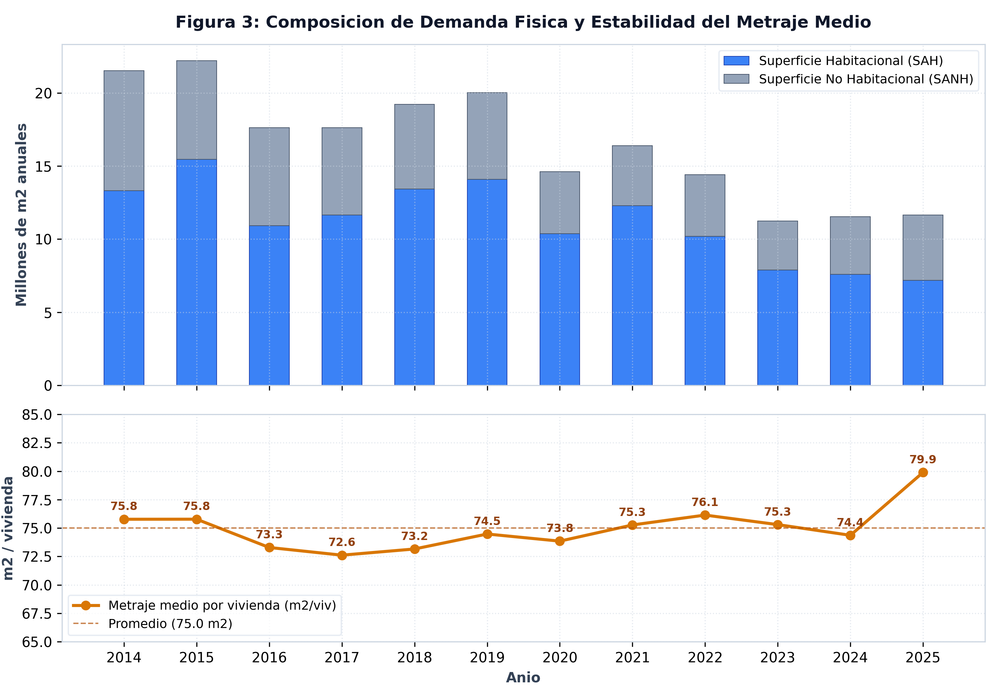

REGIONAL &middot; 16 regiones

*La renta espacial creció mientras la cantidad construida se redujo a la mitad. Lo que se valoriza es el stock existente, no la formación de capital.*

---

## El argumento: Desacoplando precio y cantidad

El Reporte 3 demostró la expansión tendencial de la renta espacial (Sector 10: *Servicios de vivienda e inmobiliarios*). No obstante, el Sector 10 contiene en buena parte **alquiler imputado**: su valor agregado aumenta automáticamente cuando se incrementa el precio de los inmuebles, se construya o no un metro cuadrado físico nuevo.

Los permisos de edificación recopilados por el INE (`SAH`, `SANH`, `NVA`) miden **cantidad física pura sin precio**: metros cuadrados autorizados y unidades de vivienda. Puestos en contraste con la participación del Sector 10, permiten discriminar entre la valorización de activos y la acumulación real de capital físico.

## La trayectoria macroeconómica nacional

Entre 2014 y 2025, la superficie habitacional autorizada a nivel nacional pasó de **13,3 millones de m²** a **7,2 millones de m²**, representa una contracción acumulada de **46,1%**. Las viviendas autorizadas cayeron de **176 mil** a **90 mil** unidades.

En el mismo período, la participación media de la renta espacial en el producto regional **subió**: alcanzó un índice de **109,9** frente al índice de **53,9** para la superficie habitacional autorizada.

### Tabla 1: Matriz Forense del Ciclo de Edificación por Región (2014 vs. 2025)

| Código | Región | Superficie Hab. 2014 (miles m²) | Superficie Hab. 2025 (miles m²) | Δ Superficie (%) | Viviendas 2014 (unid.) | Viviendas 2025 (unid.) | Δ Viviendas (%) | Δ Sector 10 (pp) |
|:---:|:---|:---:|:---:|:---:|:---:|:---:|:---:|:---:|
| `01` | Tarapacá | 238 | 148 | **-38,0%** | 2 762 | 1 850 | **-33,0%** | -0,00 pp |
| `02` | Antofagasta | 624 | 212 | **-66,0%** | 5 985 | 2 368 | **-60,4%** | -0,00 pp |
| `03` | Atacama | 118 | 75 | **-36,0%** | 1 738 | 983 | **-43,4%** | -0,01 pp |
| `04` | Coquimbo | 637 | 270 | **-57,6%** | 8 957 | 3 835 | **-57,2%** | +0,01 pp |
| `05` | Valparaíso | 1 424 | 760 | **-46,6%** | 16 647 | 8 068 | **-51,5%** | +0,01 pp |
| `06` | O'Higgins | 620 | 548 | **-11,6%** | 8 991 | 6 465 | **-28,1%** | +0,01 pp |
| `07` | Maule | 739 | 594 | **-19,7%** | 13 066 | 7 668 | **-41,3%** | +0,02 pp |
| `08` | Biobío | 1 532 | 480 | **-68,6%** | 24 803 | 6 591 | **-73,4%** | +0,02 pp |
| `09` | La Araucanía | 611 | 609 | **-0,2%** | 10 401 | 8 681 | **-16,5%** | +0,02 pp |
| `10` | Los Lagos | 466 | 536 | **+15,0%** | 6 884 | 6 374 | **-7,4%** | +0,01 pp |
| `11` | Aysén | 69 | 60 | **-12,1%** | 1 047 | 904 | **-13,7%** | +0,02 pp |
| `12` | Magallanes | 79 | 40 | **-50,1%** | 1 300 | 518 | **-60,2%** | +0,00 pp |
| `13` | Metropolitana de Santiago | 5 886 | 2 076 | **-64,7%** | 69 218 | 25 154 | **-63,7%** | +0,01 pp |
| `14` | Los Ríos | 200 | 183 | **-8,3%** | 2 817 | 2 135 | **-24,2%** | +0,01 pp |
| `15` | Arica y Parinacota | 81 | 150 | **+85,3%** | 1 206 | 1 933 | **+60,3%** | -0,00 pp |
| `16` | Ñuble | — | 435 | **—** | — | 6 298 | **—** | +0,01 pp |

### Tabla 2: Evolución Macroeconómica de la Edificación y Dinamismo Empresarial (2014–2025)

| Año | Superficie Habitacional (millones m²) | Superficie No Habitacional (millones m²) | Viviendas Autorizadas (miles unid.) | Metraje Medio (m²/viv.) | Creación Empresas (miles unid.) |
|:---:|:---:|:---:|:---:|:---:|:---:|
| 2014 | 13,32 | 8,19 | 175,8 | 75,8 | 51,5 |
| 2015 | 15,47 | 6,75 | 204,1 | 75,8 | 64,8 |
| 2016 | 10,93 | 6,69 | 149,1 | 73,3 | 76,2 |
| 2017 | 11,66 | 5,96 | 160,6 | 72,6 | 87,6 |
| 2018 | 13,44 | 5,78 | 183,7 | 73,2 | 102,0 |
| 2019 | 14,09 | 5,94 | 189,1 | 74,5 | 109,4 |
| 2020 | 10,38 | 4,24 | 140,6 | 73,8 | 134,8 |
| 2021 | 12,29 | 4,11 | 163,2 | 75,3 | 172,1 |
| 2022 | 10,19 | 4,22 | 133,8 | 76,1 | 145,6 |
| 2023 | 7,88 | 3,37 | 104,7 | 75,3 | 147,8 |
| 2024 | 7,58 | 3,96 | 102,0 | 74,4 | 165,3 |
| 2025 | 7,18 | 4,48 | 89,8 | 79,9 | 202,4 |

::: {.callout-note}
### Medición del Gran Desacople Macroeconómico (Figura 4.1)
El gráfico ilustra la divergencia entre la cantidad física autorizada ($SAH$, índice **53,9**) y la renta espacial del Sector 10 (índice **109,9**). La severa caída en los permisos demuestra que la inflación inmobiliaria no responde a un auge en la inversión real de estructuras físicas.
:::

::: {.callout-note}
### Medición de la Contracción Física por Región (Figura 4.2)
Un total de **13 de las 16 regiones** registraron niveles de edificación habitacional inferiores a los de 2014. La contracción afectó con severidad a la Región Metropolitana (-61,8%), Antofagasta (-65,6%), Biobío (-52,3%) y Valparaíso (-47,5%).
:::

::: {.callout-note}
### Medición del Metraje Medio por Unidad Habitacional (Figura 4.3)
El metraje promedio se mantuvo estable en torno a **74–76 m²** por vivienda en todo el decenio. Esto descarta que la menor cantidad de unidades autorizadas haya sido compensada por viviendas de mayor metraje unitario.
:::

## Dinámica del Empleo y la Fuerza de Trabajo en la Construcción

La severa caída en la autorización de permisos de edificación impacta de forma directa la capacidad de absorción de mano de obra en el sector productivo de la construcción (Sector 06: *Construcción*). A diferencia del Sector 10 (*Servicios inmobiliarios*), que es intensivo en capital patrimonial y rentas, la actividad de edificación física del Sector 06 es altamente intensiva en empleo directo no calificado y calificado. La contracción del -50% en los permisos frena la generación de puestos de trabajo regionales, acelerando la precarización laboral y la contracción de la demanda agregada en las economías regionales.

::: {.caveat}
**Un permiso es intención administrativa, no obra ejecutada.** Un permiso de edificación registra la autorización municipal, pero no garantiza el inicio ni la finalización inmediata de la faena.
:::

## Ortogonalidad del dinamismo empresarial (CEYS)

Mientras la actividad física de edificación se redujo a la mitad, las empresas constituidas (`CEYS`) pasaron de **52 mil** a **202 mil** entre 2014 y 2025. Esta expansión responde a la digitalización del registro de sociedades y no forma parte del eje físico espacial.

## Nota metodológica

Los permisos provienen del INE y se recopilan mensualmente a partir de formularios municipales.

::: {.fuente}
**Fuente:** elaboración propia (2026) en base a la Base de Datos Estadísticos del Banco Central de Chile. Datos: [`panel_permits_annual.csv`](../datos/panel_permits_annual.csv).
:::

