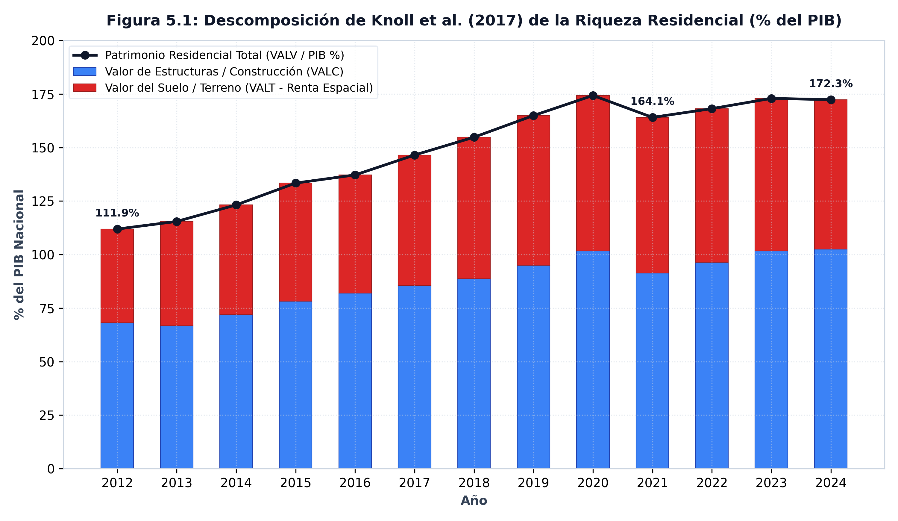
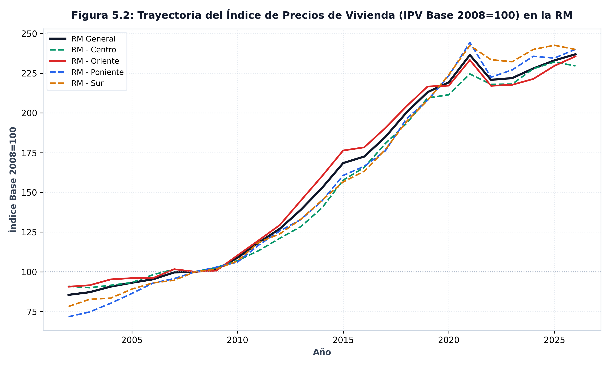
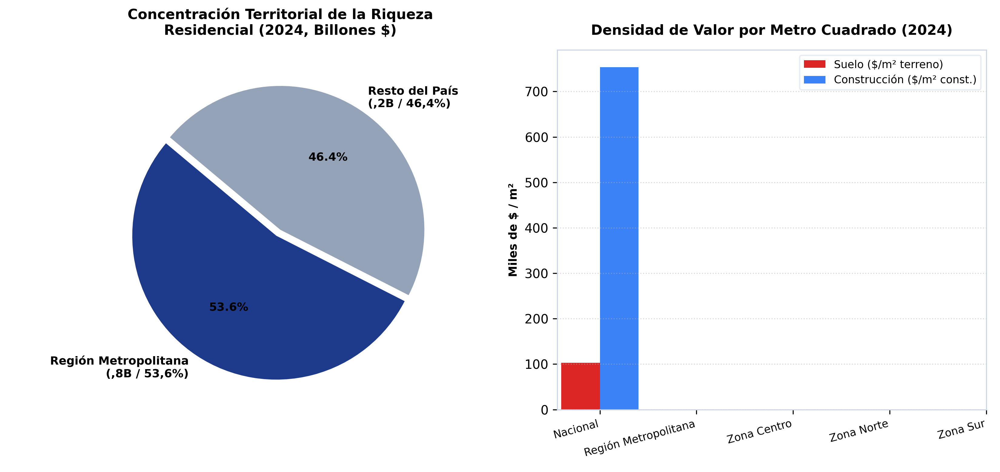

MACRO-ZONA &middot; 7 zonas

*Entre 2012 y 2024, el valor de mercado del stock habitacional chileno escaló de
145,45 billones a 537,00 billones de pesos (de 111,9% a 172,3% del PIB). El
valor del suelo subyacente creció 3,8 veces hasta
alcanzar 217,66 billones de pesos, con la Región Metropolitana concentrando el
53,6% de la riqueza inmobiliaria nacional.*

---

## El argumento

El proyecto de investigación (Figura 4 de la formulación) analiza la riqueza
inmobiliaria residencial a través de la descomposición estructural propuesta por
Knoll, Schularick y Steger (2017): el encarecimiento secular de la vivienda en
las economías capitalistas responde primordialmente a la absorción de rentas de
localización por parte del suelo urbano (`VALT`), y no al costo físico de los
materiales ni al reemplazo de estructuras construidas (`VALC`).

En Chile, la BDE publica las cuentas de stock habitacional que permiten evaluar
esta premisa de manera directa, integrando el valor de mercado de las viviendas
(`VALV`), la descomposición entre terreno y construcción, las dimensiones físicas
de metros cuadrados y propiedades, y la trayectoria del Índice de Precios de
Vivienda (`IPV`).

## Lo que muestran los datos

Entre 2012 y 2024, la valorización de mercado del stock residencial en Chile
experimentó una expansión masiva: el valor total de las viviendas pasó de
**145,45 billones de pesos** (**111,9%** del PIB) a
**537,00 billones de pesos** (**172,3%** del PIB),
multiplicándose por **3,7** veces en doce años y
alcanzando un techo histórico de **174,3%** del PIB en 2021.

### La descomposición terreno frente a construcción

Al descomponer este patrimonio residencial a escala nacional:
- El **valor del suelo urbano (`VALT`)** escaló desde **56,91 billones de pesos**
  en 2012 hasta **217,66 billones de pesos** en 2024, multiplicándose por
  **3,8** veces y elevando su participación del
  **39,1%** al **40,5%** del valor
  habitacional del país.
- El **valor de las estructuras construidas (`VALC`)** creció de
  **88,54 billones de pesos** a **319,35 billones de pesos**.

### Tabla 1: Descomposición de Knoll et al. (2017) y Concentración RM (2012 vs. 2024)

| Variable / Dimensión | 2012 | 2024 | Variación (%) / Δ pp |
|:---|:---:|:---:|:---:|
| **Valor Total Vivienda ($VALV$)** | 145,45 billones de pesos | 537,00 billones de pesos | **+269,2%** |
| **Riqueza Residencial / PIB** | 111,9% | 172,3% | **+60,4 pp** |
| **Valor del Terreno ($VALT$)** | 56,91 billones de pesos | 217,66 billones de pesos | **+282,4%** |
| **Participación Suelo ($VALT/VALV$)** | 39,1% | 40,5% | **+1,4 pp** |
| **Valor Construcción ($VALC$)** | 88,54 billones de pesos | 319,35 billones de pesos | **+260,7%** |
| **Valor Vivienda en RM** | 78,48 billones de pesos | 287,84 billones de pesos | **+266,8%** |
| **Participación RM en Riqueza Nacional** | 54,0% | 53,6% | **+-0,4 pp** |

### Concentración metropolitana y precios del suelo

La riqueza habitacional muestra una marcada concentración espacial: en 2024, la
Región Metropolitana concentra **287,84 billones de pesos**, lo que equivale al
**53,6%** de toda la riqueza habitacional chilena.

Esta valorización patrimonial se refleja en el Índice de Precios de Vivienda (`IPV`).
En la Región Metropolitana, el IPV (base 2008=100) transitó desde un nivel inicial de
**81,51** en 2002 hasta un pico de **238,85**
en 2021 (multiplicándose por **2,9** veces), situándose
en **236,93** hacia 2026.

### Tabla 2: Matriz del IPV (Base 2008=100) por Macro-Zona y Subzona RM (2002–2026)

| Macro-Zona / Subzona RM | 2002 | 2008 (Base) | 2014 | 2021 (Pico) | 2026 (Actual) | Δ Acumulada (%) |
|:---|:---:|:---:|:---:|:---:|:---:|:---:|
| **Región Metropolitana (RM General, `IPVZ4`)** | 81,5 | 100,0 | 145,8 | **238,8** | **236,9** | **+190,7%** |
| *RM - Centro (`IPVZ41`)* | 86,7 | 100,0 | 145,1 | 236,3 | 229,6 | +164,8% |
| *RM - Oriente (`IPVZ42`)* | 86,2 | 100,0 | 148,2 | 235,6 | 235,6 | +173,4% |
| *RM - Poniente (`IPVZ43`)* | 68,5 | 100,0 | 143,1 | 248,6 | 240,0 | +250,3% |
| *RM - Sur (`IPVZ44`)* | 75,4 | 100,0 | 141,5 | 248,0 | 239,9 | +218,0% |
| **Macro-Zona Norte (`IVPZ1`)** | 69,0 | 100,0 | 138,5 | 205,6 | 180,2 | +161,1% |
| **Macro-Zona Centro (`IPVZ2`)** | 79,7 | 100,0 | 139,2 | 203,4 | 196,9 | +147,1% |
| **Macro-Zona Sur (`IPVZ3`)** | 78,2 | 100,0 | 137,9 | 218,1 | 215,0 | +174,8% |

::: {.caveat}
**La geografía son macro-zonas, no regiones.** El Banco Central publica el IPV y el
valor del stock habitacional para 4 macro-zonas (Norte, Centro, Sur y RM) y cuatro
subdivisiones metropolitanas de Santiago. La descomposición terreno/construcción
(`VALT` vs `VALC`) sólo existe a escala nacional (`NAC`, `CAS`, `DEP`) y no está
disponible para macro-zonas individuales.
:::

## Nota metodológica

Las series de valor del stock de vivienda abarcan el período 2012–2024; el IPV
cubre trimestres desde 2002 con base 2008=100. En el catálogo original de la BDE,
la Zona 1 del IPV se encuentra rotulada con la transposición tipográfica `IVPZ1`.

::: {.fuente}
**Fuente:** elaboración propia (2026) en base a la Base de Datos Estadísticos del Banco Central de Chile. Datos: [`panel_housing_wealth_annual.csv`](../datos/panel_housing_wealth_annual.csv).
:::

