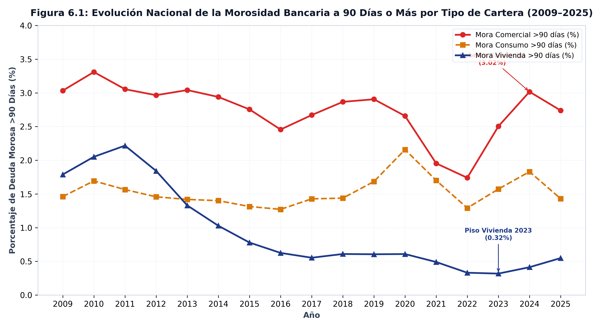
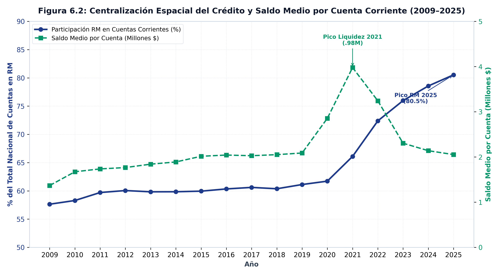
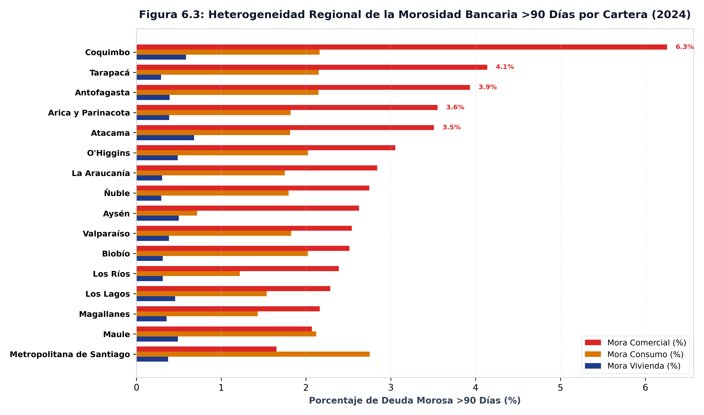

REGIONAL &middot; 16 regiones

*Entre 2009 y 2025, las cuentas corrientes pasaron de **2,02 millones** a **12,04 millones**, pero la concentración espacial de la liquidez en la Región Metropolitana escaló del **57,6%** al **80,5%** nacional. La mora hipotecaria cayó de **2,22%** a un piso de **0,32%** (reducción del **86%**), situándose en **0,55%** en 2025.*

---

## El argumento

El análisis regional de la profundidad financiera expone dos dinámicas concurrentes: el crecimiento de los depósitos bancarios de personas naturales y el desempeño desigual del riesgo de crédito por cartera. Mientras los depósitos a la vista nacionales se multiplicaron desde **462,64 miles de millones de pesos** en 2009 hasta **7,66 billones de pesos** en 2025, la centralización geográfica situó en la capital el **80,5%** de todas las cuentas corrientes de personas del país.

En el mercado de crédito, la cartera habitacional exhibe el menor nivel de impago del sistema. Durante el período de liquidez extraordinaria (2020–2021), la mora hipotecaria nacional se redujo desde un máximo histórico de **2,22%** hasta un piso de **0,32%** (una contracción de **86%**). Hacia 2025, el repunte de tasas reales elevó la mora habitacional al **0,55%**, manteniéndose muy por debajo de la mora comercial (**2,74%**) y de consumo (**1,43%**).

## Lo que muestran los datos

### Tabla 1: Matriz de Profundización Financiera y Liquidez por Región (2009 vs. 2025)

| Región | Cuentas Corrientes (2009) | Cuentas Corrientes (2025) | Depósitos a la Vista (2025) | Saldo Medio por Cuenta (2025) |
|:---|:---:|:---:|:---:|:---:|
| **Antofagasta** | 70 299 | 191 208 | 264,99 miles de millones de pesos | 2,40 millones de pesos |
| **Arica y Parinacota** | 16 510 | 57 375 | 86,96 miles de millones de pesos | 1,80 millones de pesos |
| **Atacama** | 23 389 | 62 920 | 114,50 miles de millones de pesos | 2,20 millones de pesos |
| **Aysén** | 11 362 | 27 015 | 41,95 miles de millones de pesos | 2,33 millones de pesos |
| **Biobío** | 159 974 | 341 562 | 488,44 miles de millones de pesos | 2,05 millones de pesos |
| **Coquimbo** | 45 298 | 158 872 | 255,36 miles de millones de pesos | 1,95 millones de pesos |
| **La Araucanía** | 64 040 | 167 919 | 273,13 miles de millones de pesos | 2,01 millones de pesos |
| **Los Lagos** | 63 324 | 260 754 | 290,42 miles de millones de pesos | 1,58 millones de pesos |
| **Los Ríos** | 29 005 | 81 801 | 112,54 miles de millones de pesos | 1,91 millones de pesos |
| **Magallanes** | 27 132 | 63 580 | 69,83 miles de millones de pesos | 2,11 millones de pesos |
| **Maule** | 66 043 | 199 448 | 324,03 miles de millones de pesos | 2,13 millones de pesos |
| **Metropolitana de Santiago** | 1 161 755 | 9 698 002 | 4,17 billones de pesos | 895,64 miles de pesos |
| **O'Higgins** | 57 675 | 157 342 | 319,80 miles de millones de pesos | 2,54 millones de pesos |
| **Tarapacá** | 30 825 | 81 746 | 119,09 miles de millones de pesos | 2,22 millones de pesos |
| **Valparaíso** | 188 956 | 426 979 | 582,27 miles de millones de pesos | 2,21 millones de pesos |
| **Ñuble** | 0 | 66 508 | 144,88 miles de millones de pesos | 2,51 millones de pesos |

### Tabla 2: Matriz de Morosidad Bancaria a 90 Días o Más por Cartera y Región (2025)

| Región | Mora Vivienda (%) | Mora Consumo (%) | Mora Comercial (%) |
|:---|:---:|:---:|:---:|
| **Antofagasta** | 0,55% | 1,62% | 3,40% |
| **Arica y Parinacota** | 0,59% | 1,43% | 3,49% |
| **Atacama** | 0,79% | 1,40% | 2,48% |
| **Aysén** | 0,65% | 0,66% | 1,90% |
| **Biobío** | 0,41% | 1,67% | 1,96% |
| **Coquimbo** | 0,86% | 1,73% | 6,26% |
| **La Araucanía** | 0,43% | 1,42% | 2,65% |
| **Los Lagos** | 0,65% | 1,26% | 1,99% |
| **Los Ríos** | 0,38% | 0,98% | 2,05% |
| **Magallanes** | 0,44% | 1,04% | 2,07% |
| **Maule** | 0,61% | 1,61% | 2,08% |
| **Metropolitana de Santiago** | 0,52% | 2,23% | 1,70% |
| **O'Higgins** | 0,58% | 1,58% | 3,38% |
| **Tarapacá** | 0,34% | 1,50% | 3,28% |
| **Valparaíso** | 0,55% | 1,37% | 2,56% |
| **Ñuble** | 0,42% | 1,38% | 2,57% |

::: {.callout-note}
### Transmisión Macro-Financiera de la Morosidad (Figura 6.1)
La tasa de morosidad a 90 días o más ($DV90_{k,t}$) aísla el porcentaje de saldo impago sobre la cartera total $k$. Durante 2020–2021, la liquidez inyectada a los hogares redujo la morosidad habitacional al piso histórico de **0,32%**. El ciclo posterior de contracción monetaria re-aceleró el impago comercial al **2,74%**, evidenciando que el estrés financiero impacta primero a las firmas de menor escala y a las carteras de consumo.
:::

::: {.callout-note}
### Medición de la Centralización Espacial de la Liquidez (Figura 6.2)
La concentración metropolitana de la liquidez ($C_{RM,t} = CCPN_{RM,t} / CCPN_{NAC,t}$) mide la proporción de cuentas corrientes de personas naturales localizadas en la Región Metropolitana. Su ascenso del **57,6%** al **80,5%** demuestra que la expansión bancaria nacional ha profundizado la centralización patrimonial en la capital, mientras el saldo medio por cuenta se contrajo desde el pico de $3,98 millones en 2021 a $2,05 millones en 2025.
:::

::: {.callout-note}
### Medición de la Heterogeneidad Regional de Riesgo (Figura 6.3)
La dispersión geográfica de la mora refleja las estructuras productivas regionales. En 2025, la mora habitacional oscila entre **0,34%** en Tarapacá y **0,86%** en Coquimbo. Las regiones del norte minero y del centro-norte (Coquimbo y Tarapacá) concentran los mayores niveles de mora comercial, mientras las regiones agrícolas del sur exhiben mayor estabilidad en la cartera habitacional.
:::

::: {.caveat}
**Un porcentaje de cartera sube por dos motivos distintos.** Estas series son
mora sobre el saldo de cada cartera, no montos: una alza puede venir de más
deudores en problemas *o* de una cartera que se contrae. Distinguirlo exige el
volumen de crédito por región, y el Banco Central **no lo publica**: los montos
hipotecarios, las tasas y el LTV son nacionales. Esta familia dice cómo le va
al deudor en cada región, nunca cuánto crédito entró en cada región.
:::

## Nota metodológica

Ninguno de los seis indicadores es un flujo. Las tres tasas de mora son
porcentajes de carteras **distintas**, con denominadores distintos: sumarlas no
significa nada, y ponderarlas exigiría el tamaño de cada cartera regional, que
esta familia no trae. Los tres saldos son stocks. Todo se promedia sobre los
doce meses del año; nada se acumula.

Los saldos están en **pesos nominales**, sin deflactar. La multiplicación de los
depósitos a la vista mezcla inflación con profundización financiera, y separarlas
exige un índice de precios que es nacional.

`CCPN` cuenta **cuentas**, no personas: una persona puede tener varias y una
cuenta puede ser de una empresa. No es una medida de inclusión financiera per
cápita, y no puede convertirse en una, porque la población regional no existe
como serie del Banco Central.

::: {.fuente}
**Fuente:** elaboración propia (2026) en base a la Base de Datos Estadísticos del Banco Central de Chile. Datos: [`panel_financial_depth_annual.csv`](../datos/panel_financial_depth_annual.csv).
:::

