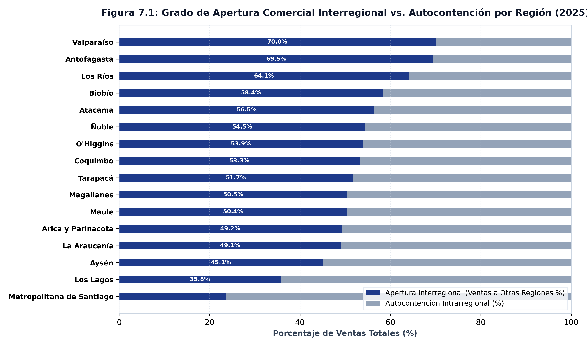
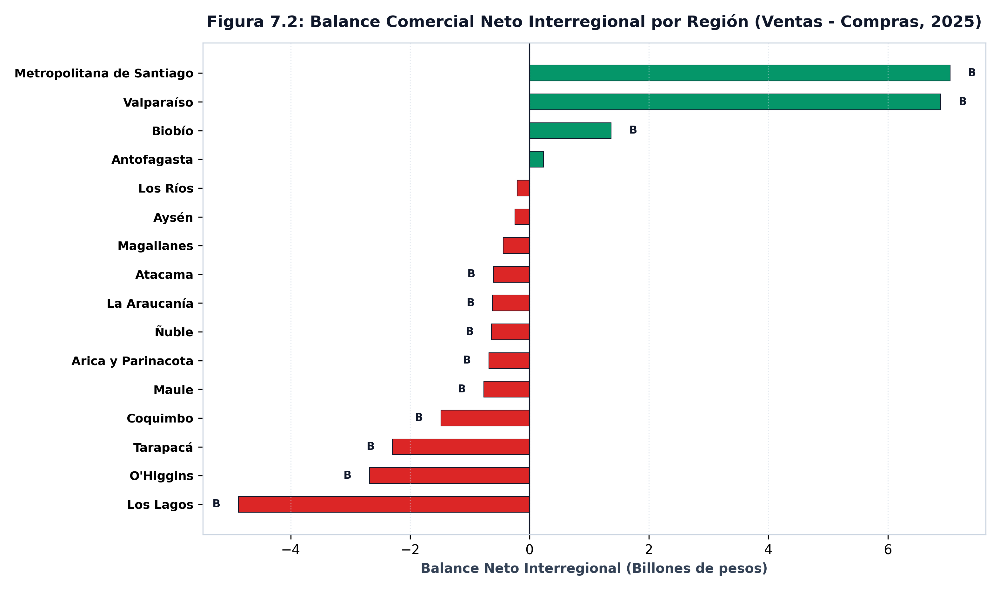
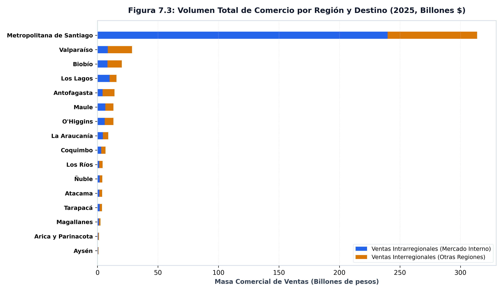

REGIONAL &middot; 16 regiones

*Las compraventas interregionales revelan una estructura polarizada: la Región Metropolitana autocontiene el **76,4%** de sus ventas, mientras las economías productivas regionales dependen de la demanda externa.*

---

## El argumento

El análisis de compraventas interregionales evalúa si la valorización de activos inmobiliarios convive con la articulación o el estancamiento del sector productivo transable. Las series del Banco Central desagregan los márgenes de ventas interregionales (`ITE`) e intrarregionales (`ITA`), permitiendo evaluar la apertura comercial externa y la autocontención interna de cada región.

Entre 2018 y 2025, las ventas interregionales nominales pasaron de **79,54 billones de pesos** a **154,23 billones de pesos**, mientras el volumen de facturas emitidas pasó de **106,9 millones** a **139,2 millones**.

## Lo que muestran los datos

La estructura del comercio interregional exhibe una asimetría marcada. La Región Metropolitana opera como un nodo fuertemente autocontenido: retiene el **76,4%** de sus ventas dentro de su territorio, registrando una tasa de apertura interregional de solo **23,6%**.

En contraste, las regiones productivas dependen de la demanda externa: la tasa de apertura alcanza el **70,0%** en Valparaíso, el **69,5%** en Antofagasta y el **64,1%** en Los Ríos. Fuera de Santiago, únicamente Los Lagos (**64,2%**) y Aysén (**54,9%**) exhiben una fracción relevante de autocontención interna.

### Tabla 1: Matriz de Apertura Comercial y Autocontención por Región (2025)

| Región | Tasa de Apertura (%) | Tasa de Autocontención (%) | Balance Neto (% Intercambio) |
|:---|:---:|:---:|:---:|
| **Antofagasta** | 69,5% | 30,5% | 1,2% |
| **Arica y Parinacota** | 49,2% | 50,8% | -35,8% |
| **Atacama** | 56,5% | 43,5% | -12,3% |
| **Aysén** | 45,1% | 54,9% | -23,4% |
| **Biobío** | 58,4% | 41,6% | 6,2% |
| **Coquimbo** | 53,3% | 46,7% | -17,2% |
| **La Araucanía** | 49,1% | 50,9% | -6,6% |
| **Los Lagos** | 35,8% | 64,2% | -30,3% |
| **Los Ríos** | 64,1% | 35,9% | -3,6% |
| **Magallanes** | 50,5% | 49,5% | -14,7% |
| **Maule** | 50,4% | 49,6% | -5,4% |
| **Metropolitana de Santiago** | 23,6% | 76,4% | 5,0% |
| **O'Higgins** | 53,9% | 46,1% | -15,9% |
| **Tarapacá** | 51,7% | 48,3% | -36,8% |
| **Valparaíso** | 70,0% | 30,0% | 20,8% |
| **Ñuble** | 54,5% | 45,5% | -12,5% |

### Tabla 2: Matriz de Flujos Comerciales Interregionales (2025)

| Región | Ventas a Otras Regiones | Compras a Otras Regiones | Saldo Neto Interregional |
|:---|:---:|:---:|:---:|
| **Antofagasta** | 9,82 billones de pesos | 9,59 billones de pesos | 232,45 miles de millones de pesos |
| **Arica y Parinacota** | 612,34 miles de millones de pesos | 1,29 billones de pesos | -682,54 miles de millones de pesos |
| **Atacama** | 2,17 billones de pesos | 2,77 billones de pesos | -607,25 miles de millones de pesos |
| **Aysén** | 397,57 miles de millones de pesos | 640,33 miles de millones de pesos | -242,76 miles de millones de pesos |
| **Biobío** | 11,72 billones de pesos | 10,35 billones de pesos | 1,37 billones de pesos |
| **Coquimbo** | 3,57 billones de pesos | 5,05 billones de pesos | -1,48 billones de pesos |
| **La Araucanía** | 4,37 billones de pesos | 4,99 billones de pesos | -619,95 miles de millones de pesos |
| **Los Lagos** | 5,62 billones de pesos | 10,49 billones de pesos | -4,87 billones de pesos |
| **Los Ríos** | 2,77 billones de pesos | 2,97 billones de pesos | -206,71 miles de millones de pesos |
| **Magallanes** | 1,27 billones de pesos | 1,71 billones de pesos | -439,73 miles de millones de pesos |
| **Maule** | 6,67 billones de pesos | 7,44 billones de pesos | -765,36 miles de millones de pesos |
| **Metropolitana de Santiago** | 73,93 billones de pesos | 66,89 billones de pesos | 7,04 billones de pesos |
| **O'Higgins** | 7,10 billones de pesos | 9,78 billones de pesos | -2,68 billones de pesos |
| **Tarapacá** | 1,97 billones de pesos | 4,27 billones de pesos | -2,29 billones de pesos |
| **Valparaíso** | 20,03 billones de pesos | 13,14 billones de pesos | 6,89 billones de pesos |
| **Ñuble** | 2,22 billones de pesos | 2,85 billones de pesos | -635,97 miles de millones de pesos |

::: {.callout-note}
### Medición de Apertura y Autocontención (Figura 7.1)
La tasa de apertura interregional ($AP_{r,t} = V_{inter,r,t} / V_{total,r,t}$) aísla la fracción de ventas regionales orientadas al resto del país, mientras la autocontención ($AC_{r,t} = V_{intra,r,t} / V_{total,r,t}$) mide la densidad del mercado interno regional. La alta autocontención de la RM (**76,4%**) refleja su rol como centro de consumo final.
:::

::: {.callout-note}
### Medición del Balance Neto Interregional (Figura 7.2)
De las 16 regiones, solo cuatro registran un balance neto positivo frente al resto del país: Valparaíso (**20,8%** del intercambio bruto), Biobío (**6,2%**), la Región Metropolitana (**5,0%**) y Antofagasta (**1,2%**). Las doce regiones restantes son deficitarias netas, destacando brechas de **36,8%** en Tarapacá, **35,8%** en Arica y Parinacota, y **30,3%** en Los Lagos.
:::

::: {.callout-note}
### Medición de la Masa de Comercio Interregional (Figura 7.3)
La masa comercial combina el volumen de ventas intrarregionales e interregionales. Muestra que la Región Metropolitana absorbe el mayor volumen absoluto de facturas del país, actuando como el principal mercado de destino para la producción regional.
:::

::: {.caveat}
**El catálogo no contiene series de productividad.** La búsqueda de «productividad» en las series del Banco Central arroja cero resultados. El dinamismo o estancamiento del sector productivo debe argumentarse a partir de participaciones de valor y flujos comerciales.
:::

## Nota metodológica

Las compraventas inician en **2018** (2018), constituyendo la capa regional más corta del sistema. Los montos están en pesos nominales y la identidad `total = inter + intra` se cumple de forma exacta.

::: {.fuente}
**Fuente:** elaboración propia (2026) en base a la Base de Datos Estadísticos del Banco Central de Chile. Datos: [`panel_interregional_trade_annual.csv`](../datos/panel_interregional_trade_annual.csv).
:::

