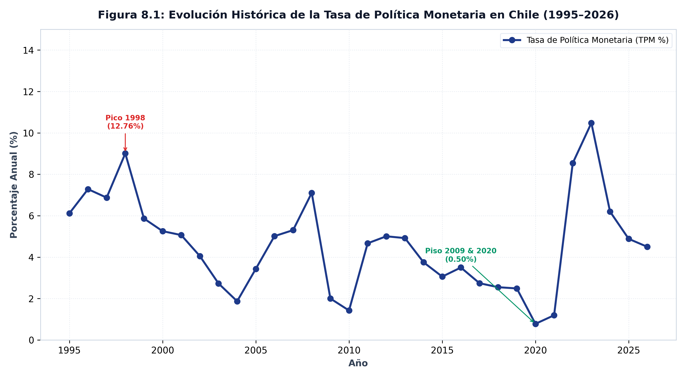
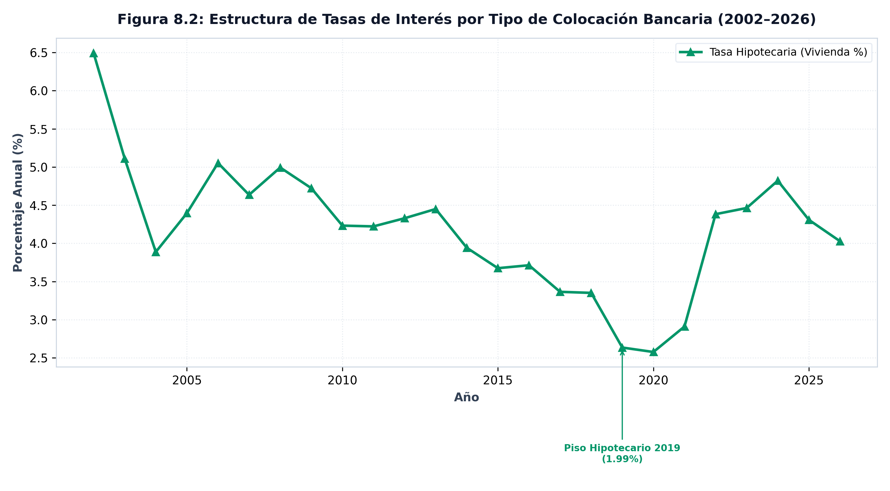
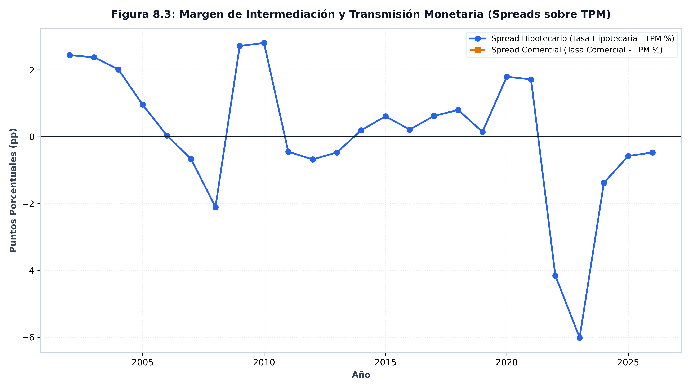

NACIONAL &middot; una economía

*El desplome de la tasa de créditos hipotecarios desde más del **7,51%** hasta un piso histórico de **1,99%** en 2019 constituyó el principal estímulo financiero a la valorización del suelo. Paralelamente, el apalancamiento de los hogares sobre su ingreso disponible se multiplicó por **2,7** veces.*

---

## El argumento

La hipótesis central del proyecto (H1) postula que la inflación del precio del suelo metropolitano en Chile responde primordialmente a un determinante financiero: el descenso tendencial de la tasa de descuento con que se descuenta el flujo futuro de rentas. Al ser el suelo un activo que no se deprecia ni se reproduce físicamente, una reducción sustantiva de la tasa de interés real genera una expansión mecánica y no lineal en su valor de capitalización.

La BDE concentra a escala nacional el conjunto completo de regresores financieros requeridos para contrastar este mecanismo (Tabla 1 de la formulación): la Tasa de Política Monetaria (`TPM`), las expectativas de mercado, las tasas de colocación bancaria a largo plazo (`VIV`), la curva soberana en UF (`BCU`) y los ratios de apalancamiento bancario de los hogares (`DEUBH`).

## Lo que muestran los datos

La trayectoria de las tasas hipotecarias en Chile documenta con nitidez el ciclo financiero. A comienzos de la serie (2002), la tasa promedio de colocación para vivienda en UF se situaba en **7,51%**. Durante las dos décadas siguientes experimentó un descenso sostenido que culminó en un piso histórico de **1,99%** a fines de 2019. Posteriormente, el ciclo de ajuste monetario post-pandemia elevó la tasa hasta situarse actualmente en **4,00%**.

La Tasa de Política Monetaria (`TPM`) acompañó esta dinámica, transitando desde máximos históricos de **12,76%** (durante la crisis asiática de 1998) hasta mínimos técnicos de **0,50%** durante los shocks de 2009 y 2020–2021, ubicándose en **4,50%** en 2026.

### Tabla 1: Matriz de Tasas de Interés y Política Monetaria (1995–2026)

| Indicador de Tasa | Mínimo Histórico | Máximo Histórico | Nivel Actual (2026) |
|:---|:---:|:---:|:---:|
| **Tasa de Política Monetaria (TPM)** | **0,50%** | **12,76%** | **4,50%** |
| **Tasa Hipotecaria (Vivienda)** | **1,99%** | **7,51%** | **4,00%** |

### Tabla 2: Matriz de Apalancamiento y Deuda de los Hogares

| Métrica de Deuda de Hogares | Mínimo Histórico | Máximo Histórico | Nivel Actual (2026) |
|:---|:---:|:---:|:---:|
| **Deuda / PIB (%)** | **11,5%** | **28,8%** | **26,0%** |
| **Deuda / Ingreso Disponible (%)** | **17,8%** | **47,8%** | **44,1%** |
| **Apalancamiento Relativo** | 1,0x | **2,7** veces | -- |

::: {.callout-note}
### Medición de la Tasa de Política Monetaria (Figura 8.1)
La TPM es la tasa objetivo fijada por el Banco Central para las operaciones interbancarias. Su reducción al piso histórico de **0,50%** estimuló la expansión del crédito hipotecario, mientras su alza acelerada contuvo la liquidez pos-pandemia.
:::

::: {.callout-note}
### Medición de la Estructura de Tasas por Colocación (Figura 8.2)
La tasa de interés hipotecaria a largo plazo alcanzó su piso de **1,99%** en 2019. Su trayectoria evidencia una menor volatilidad que las tasas de consumo y comerciales, pero su repunte actual al **4,00%** encarece el dividendo mensual de las nuevas colocaciones.
:::

::: {.callout-note}
### Medición del Apalancamiento y Deuda de Hogares (Figura 8.3)
Este abaratamiento del costo del crédito facilitó una acumulación masiva de deuda hipotecaria. Medida a través de las cuentas nacionales (`DEUBH`), la deuda bancaria hipotecaria de los hogares pasó de representar el **17,8%** del ingreso disponible a un máximo de **47,8%**, multiplicándose por **2,7** veces antes de estabilizarse en **44,1%**. Como proporción del PIB, la deuda escaló desde **11,5%** hasta un techo de **28,8%**, situándose en **26,0%**.
:::

::: {.caveat}
**La escala nacional es un precio único.** A diferencia de los flujos físicos de construcción o la morosidad bancaria regional, las tasas de interés y los bonos soberanos operan como precios únicos para toda la economía chilena. El análisis econométrico de H1 utiliza estas variables como regresores macroeconómicos comunes a todas las áreas metropolitanas bajo estudio.
:::

## Nota metodológica

Las series de captación y colocación inician en 1983; la TPM en 1995 (nominalizada en agosto de 2001); las tasas hipotecarias desagregadas y bonos BCU en 2002; y los ratios de deuda de hogares `DEUBH` en 2003. El panel anual integra los promedios anuales de series mensuales y trimestrales con años completos.

::: {.fuente}
**Fuente:** elaboración propia (2026) en base a la Base de Datos Estadísticos del Banco Central de Chile. Datos: [`panel_tasas_annual.csv`](../datos/panel_tasas_annual.csv).
:::

